=== ADDsynth

AdSynth, a primarily _additive synthesis_ engine, is one of the three major synthesis engines available in Zyn-Fusion. The basic concept of this engine is the summation of a collection of sin waves.

We call these sin waves "voices" and can use up to 8 with ADDsynth.

.Additive Synthesis
NOTE: Very briefly, additive synthesis is multiple sin waves added together (but we use complex maths to calculate the relationship between waves).

You can consider each voice another stage/step in the process of building your sound.

We can modify the output of each voice using LFOs, envelopes, and filters.

We can set global LFO, envelope, and filter settings, as well as individual settings per voice.

.Basic Flow
NOTE: The output of ADDsynth will always include a combination of individual Voice settings being applied on top of Global settings. Global settings will be applied to an active voices before any individual voice settings are applied.

==== LFOs
"LFO" means Low Frequency Oscillator. These oscillators are not used to make sounds by themselves, but they change some parameters (like the frequencies, the amplitudes, or the filters).

The LFOs have some basic parameters:

- *Delay:* This parameter sets how much time takes since the start of the note to the start of the LFO
- *Start Phase:* The position that a LFO will start at
- *Frequency:* How fast the LFO is (i.e. how fast the parameter’s controlled by the LFO changes)
- *Depth:* The amplitude of the LFO (i.e. how much the parameter’s controlled by the LFO changes)

Zyn-Fusion includes the following LFOs _globally_ *and* _per voice_: *Amplitude LFO*, *Frequnecy LFO*, *Filter LFO*.

.27 possible LFOs
NOTE: You will find 3 global as well as 3 individual LFO settings (per voice), one in each of the Amplitude, Frequency, and Filter tabs for a possible total of 27 LFOs. (8 voices x 3 LFO per voice = 24 + 3 global = 27)

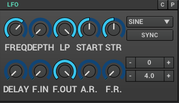

- *Freq:* LFO Frequency
- *Depth:* LFO Depth
- *Start:* LFO Start Phase - If this knob is at the lowest value, the LFO Start Phase will be random.
- *Str.:* LFO Stretch
- *Delay:* LFO Delay
- *A.R.:* LFO Amplitude Randomness
- *F.R.:* LFO Frequency Randomness
- *Sync:* ???

==== Filters
Zyn-Fusion offers several different types of filters, which can be used to shape the spectrum of a signal. The primary parameters that affect the characteristics of the filter are the cutoff, resonance, filter stages, and the filter type.

- *Cutoff:* This value determines which frequency marks the changing point for the filter. In a low pass filter, this value marks the point where higher frequencies are attenuated.
- *Resonance:* The resonance of a filter determines how much excess energy is present at the cutoff frequency. In Zyn-Fusion, this is represented by the Q-factor, which is defined to be the cutoff frequency divided by the bandwidth. In other words higher Q values result in a much more narrow resonant spike.
- *Stages:* The number of stages in a given filter describes how sharply it is able to make changes in the frequency response.

====== General
image::imgs/filter-analog.png[]

- *Cutoff:* Cutoff frequency.
- *Q:* Level of resonance for the filter.
- *F.Track:* Frequency tracking amount. When this parameter is positive, higher note frequencies shift the filter’s cutoff frequency higher.
- *Scale:* ???
- *Sense:* Velocity sensing. (100% to the right to disable).
- *Stages:* Filter stages.
- *Class:* Category of synth.
- *Type:* Type of filter to use.
- *Gain:* Additional gain/attenuation for filter.

==== Envelopes
Zyn-Fusion includes the following global and per-voice envelopes: *Amplitude*, *Frequency*, and *Filter*.

Envelopes control how the amplitude, frequency, or filter changes over time.

The Envelopes share the same basic parameters:

- *Attack:* Begins at the Note On. The volume starts from 0 to the maximum. In Zyn-Fusion, the attack is always linear.
- *Sustain:* The volume remains constant until the key is depressed (Note Off). After this, the last stage take place.
- *Release:* The volume drops to zero
- *Decay:* The volume drops from the maximum value to a level called "Sustain level"
- *Stretch:* How the envelope is stretched according to the note. On the higher notes the envelopes are shorter than lower notes.
- *Forced release:* If this option is turned on the release will go to the final value, even if the sustain stage is not reached.

===== Amplitude Envelopes
Amplitude envelopes control the amplitude of the sound.

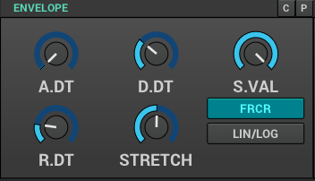 

- *A.DT:* Attack duration.
- *D.DT:* Decay duration.
- *R.DT:* Release duration.
- *S.VAL:* Sustain value.
- *Stretch:*  In the leftmost value, the stretch is zero. The rightmost use a stretch of 200%; this means that the envelope is stretched about 4 times/octave.
- *FRCR:* Forced release. Usually, this must be set.
- *LIN/LOG:* If this option is set, the envelope is linear, otherwise, it will be logarithmic.

===== Filter Envelopes
Filter envelopes control the cutoff frequency of the filters. They share the same configuration options as the Amplitude envelopes while introducing the following new ones:

image::imgs/env-filter.png[]

- *A.VAL:* Attack value.
- *D.VAL:* Decay value.
- *R.VAL:* Release value.

===== Frequency Envelopes
These envelopes control the frequency (more exactly, the pitch) of the oscillators.

They share the same confiuration options as the other envelopes, minus the decay options.

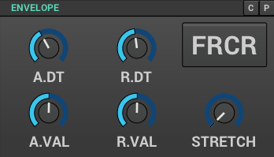

==== Global settings
These settings will be applied to all voices.

===== Amplitude
image::imgs/add-synth.png[]

====== Amplitude - general global settings
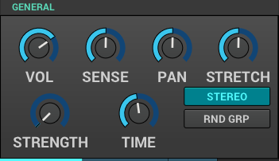
- *Vol:* Controls the overall output volume of the synth.
- *Sense:* Velocity sensing. (100% to the right to disable).
- *Pan:* Panning. (100% to the left is random).
- *Stretch:*  Punch effect stretch according to frequency. On lower notes the punch effect lasts longer.
- *Stregth:* Punch effect strength.
- *Time:* Punch effect duration (from 0.1 ms to 100 ms on A note- 440Hz).
- *Stereo:* when disabled all voices will have panning disabled.
- *RND GRP:* Enable/disable harmonic amplitude randomness of voices with a common oscllator.

===== Frequency
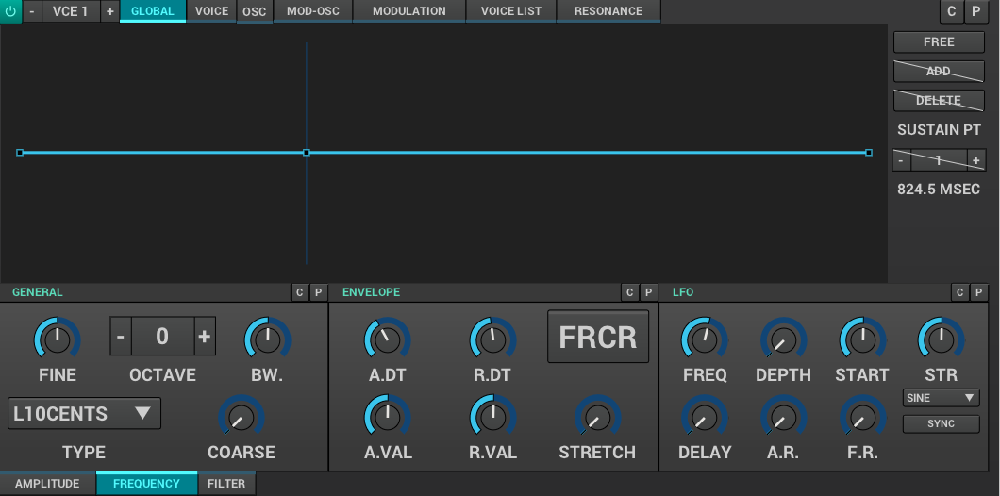

====== Frequency - general global settings
These are your "detune" options.

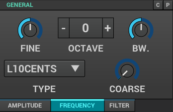

- *Fine:* Fine detune; amount of detune of all voices
- *Octave:* Raise/lower the octave note offset.
- *BW:* Relative fine detune gain.
- *Type:* Detune scaling type; sets "Fine" and "Coarse" detune behavior 
- *Coarse:* Coarse detune.

==== Voice settings
The Voice settings allow you to modify settings _per voice_. These options include all of the `Global Settings` we covered above as well as new ones such as the modulator, oscillator, and unison features.

.Helpful Tip
NOTE: The output of any single voice will always include a combination of individual Voice settings being applied on top of Global settings. Global settings will be applied to an active voices _before_ any individual voice settings are applied.

===== Amplitude
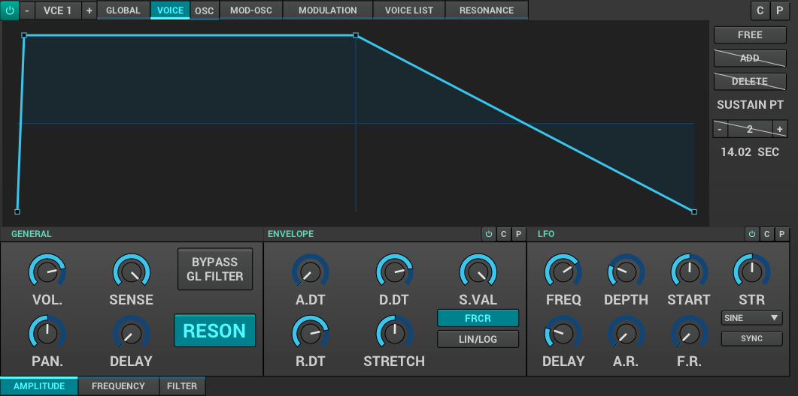

====== Amplitude - general voice settings
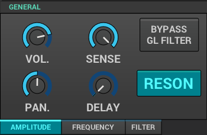

- *Vol:* Controls the overall output volume of the voice.
- *Sense:* Velocity sensing. (100% to the right to disable).
- *Pan:* Panning. (100% to the left is random).
- *Delay:* delay before the voice starts.
- *Bypass GL Filter:* If the voice signal bypasses the global filter.
- *RESON:* Enable/Disable the resonance of the voice.

===== Frequency
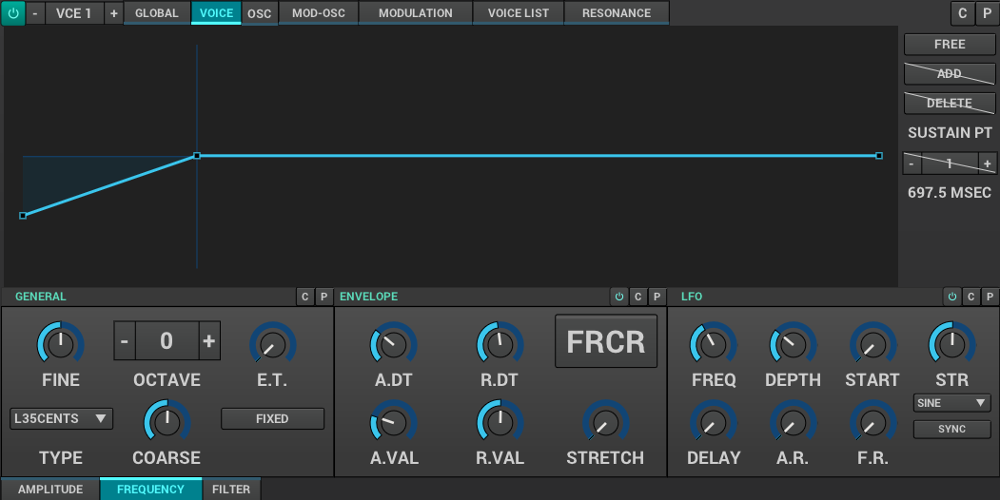

====== Frequency - general voice settings
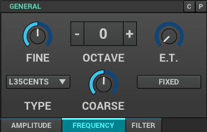

- *Fine:* Fine detune; amount of detune of all voices
- *Octave:* Raise/lower the octave note offset.
- *ET:* when disabled the synth will use Equal Temperament 12 notes/octave.
- *Type:* Detune scaling type; sets "Fine" and "Coarse" detune behavior.
- *Coarse:* Coarse detune.
- *Fixed:* Enable if frequency is fixed.

==== osc / mod-osc
This is your oscillator and modulator-oscillator. Full documentation link:OscillatorModule.adoc[available here]

==== modulation

===== Amplitude
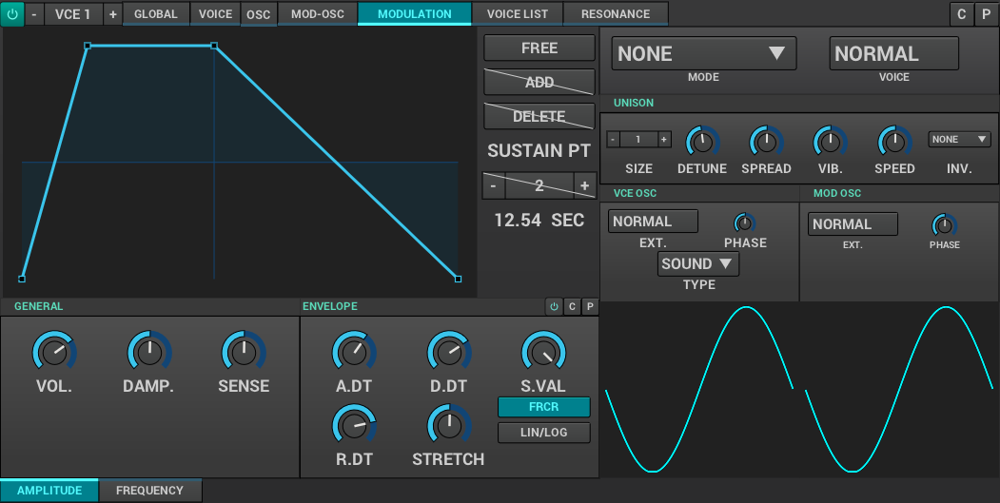

===== Frequency
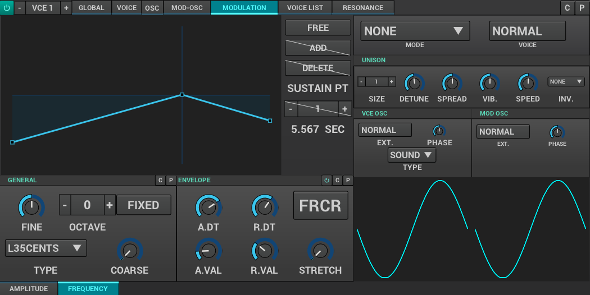

==== voice list
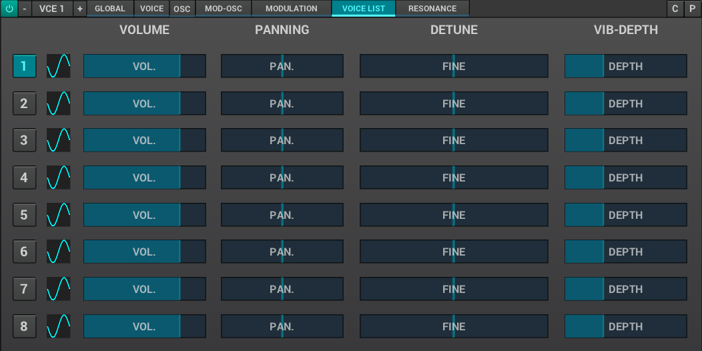

==== resonance
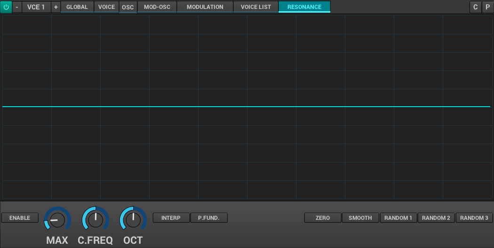

* [TODO] signal routing diagram
