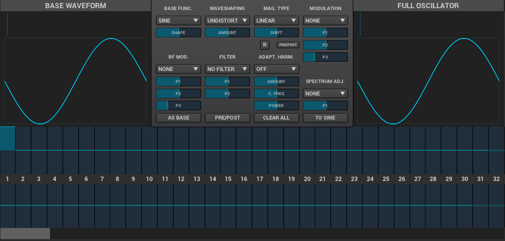

=== ADDsynth

AdSynth, a primarily _additive synthesis_ engine, is one of the three major synthesis engines available in Zyn-Fusion. The basic concept of this engine is the summation of a collection of voices, each of which consist of oscillators.

.Additive Synthesis
NOTE: Additive synthesis creates sound by combining multiple sin waves of varying phases and amplitudes; typically starting with a single sin wave (carrier) and modulating it with other sin waves (modulators).

==== Global settings
These settings will be applied to all voices.

===== Amplitude
image::imgs/add-synth.png[]

====== General
image::imgs/add-synth-global-amp-general.png[]
- *Vol:* Controls the overall output volume of the synth.
- *Sense:* Velocity sensing. (100% to the right to disable).
- *Pan:* Panning. (100% to the left is random).
- *Stretch:*  Punch effect stretch according to frequency. On lower notes the punch effect lasts longer.
- *Stregth:* Punch effect strength.
- *Time:* Punch effect duration (from 0.1 ms to 100 ms on A note- 440Hz).
- *Stereo:* when disabled all voices will have panning disabled.
- *RND GRP:* Enable/disable harmonic amplitude randomness of voices with a common oscllator.

====== Envelope
Envelopes control how the amplitude, the frequency, or the filter changes over time.

These envelopes controls the amplitude of the sound. In Zyn-Fusion, amplitude envelopes can be linear or logarithmic. 

The amplitude envelope is divided into:

- *Attack:* Begins at the Note On. The volume starts from 0 to the maximum. In ZynAddSubFX, the attack is always linear.
- *Decay:* The volume drops from the maximum value to a level called "Sustain level"
- *Sustain:* The volume remains constant until the key is depressed (Note Off). After this, the last stage take place.
- *Release:* The volume drops to zero

image::imgs/add-synth-global-amp-envelope.png[]

- *A.DT:* Attack duration.
- *D.DT:* Decay duration.
- *S.VAL:* Sustain value.
- *R.DT:* Release value.
- *Stretch:* How the envelope is stretched according the note. On the higher notes the envelopes are shorter than lower notes. In the leftmost value, the stretch is zero. The rightmost use a stretch of 200%; this means that the envelope is stretched about 4 times/octave.
- *FRCR:*  Forced release. This means that if this option is turned on, the release will go to the final value, even if the sustain stage is not reached. Usually, this must be set.
- *LIN/LOG:* If this option is set, the envelope is linear, otherwise, it will be logarithmic.

====== LFO
"LFO" means Low Frequency Oscillator. These oscillators are not used to make sounds by themselves, but they changes some parameters (like the frequencies, the amplitudes or the filters).

The LFOs have some basic parameters:

- *Delay:* This parameter sets how much time takes since the start of the note to the start of the LFO
- *Start Phase:* The position that a LFO will start at
- *Frequency:* How fast the LFO is (i.e. how fast the parameter’s controlled by the LFO changes)
- *Depth:* The amplitude of the LFO (i.e. how much the parameter’s controlled by the LFO changes)

image::imgs/add-synth-global-amp-lfo.png[]

- *Freq:* LFO Frequency
- *Depth:* LFO Depth
- *Start:* LFO Start Phase - If this knob is at the lowest value, the LFO Start Phase will be random.
- *Str.:* LFO Stretch
- *Delay:* LFO Delay
- *A.R.:* LFO Amplitude Randomness
- *F.R.:* LFO Frequency Randomness
- *C.:* LFO Continuous Mode

===== Frequency
image::imgs/add-synth-global-frequency.png[]

====== General
These are your "detune" options.

image::imgs/add-synth-global-frequency-general.png[]

- *Fine:* Fine detune; amount of detune of all voices
- *Octave:* Raise/lower the octave note offset.
- *BW:* Relative fine detune gain.
- *Type:* Detune scaling type; sets "Fine" and "Coarse" detune behavior 
- *Coarse:* Coarse detune.

====== Envelope
These envelopes controls the frequency (more exactly, the pitch) of the oscillators.

The frequency envelopes are divided into 3 stages:

- *Attack:* Begins at the Note On. The frequency starts from a certain value and glides to the real frequency of the note.
- *Sustain:* The frequency is the same on over the sustain period.
- *Release:* This stage begins on Note Off and glides the frequency of the note to a certain value.

image::imgs/add-synth-global-frequency-envelope.png[]

- *A.DT:* Attack duration.
- *R.DT:* Release duration.
- *A.VAL:* Attack value.
- *R.VAL:* Release value.
- *Stretch:* How the envelope is stretched according the note. On the higher notes the envelopes are shorter than lower notes. In the leftmost value, the stretch is zero. The rightmost use a stretch of 200%; this means that the envelope is stretched about 4 times/octave.
- *FRCR:* Forced release. This means that if this option is turned on, the release will go to the final value, even if the sustain stage is not reached. Usually, this must be set.

====== LFO
image::imgs/add-synth-global-frequency-lfo.png[]

- *Freq:* LFO Frequency
- *Depth:* LFO Depth
- *Start:* LFO Start Phase - If this knob is at the lowest value, the LFO Start Phase will be random.
- *Str.:* LFO Stretch
- *Delay:* LFO Delay
- *A.R.:* LFO Amplitude Randomness
- *F.R.:* LFO Frequency Randomness
- *Sync:* ???

===== Filter
Zyn-Fusion offers several different types of filters, which can be used to shape the spectrum of a signal. The primary parameters that affect the characteristics of the filter are the cutoff, resonance, filter stages, and the filter type.

- *Cutoff:* This value determines which frequency marks the changing point for the filter. In a low pass filter, this value marks the point where higher frequencies are attenuated.
- *Resonance:* The resonance of a filter determines how much excess energy is present at the cutoff frequency. In Zyn-Fusion, this is represented by the Q-factor, which is defined to be the cutoff frequency divided by the bandwidth. In other words higher Q values result in a much more narrow resonant spike.
- *Stages:* The number of stages in a given filter describes how sharply it is able to make changes in the frequency response.

image::imgs/add-synth-global-filter.png[]

====== General
image::imgs/add-synth-global-filter-general.png[]

- *Cutoff:* Cutoff frequency.
- *Q:* Level of resonance for the filter.
- *F.Track:* Frequency tracking amount. When this parameter is positive, higher note frequencies shift the filter’s cutoff frequency higher.
- *Scale:* ???
- *Sense:* Velocity sensing. (100% to the right to disable).
- *Stages:* Filter stages.
- *Class:* Category of synth.
- *Type:* Type of filter to use.
- *Gain:* Additional gain/attenuation for filter.

====== Envelope
image::imgs/add-synth-global-filter-envelope.png[]

- *A.DT:* Attack duration.
- *D.DT:* Decay duration.
- *R.DT:* Release duration.
- *A.VAL:* Attack value.
- *D.VAL:* Decay value.
- *R.VAL:* Release value.
- *Stretch:* How the envelope is stretched according the note. On the higher notes the envelopes are shorter than lower notes. In the leftmost value, the stretch is zero. The rightmost use a stretch of 200%; this means that the envelope is stretched about 4 times/octave.
- *FRCR:* Forced release. This means that if this option is turned on, the release will go to the final value, even if the sustain stage is not reached. Usually, this must be set.

====== LFO
image::imgs/add-synth-global-filter-lfo.png[]

- *Freq:* LFO Frequency
- *Depth:* LFO Depth
- *Start:* LFO Start Phase - If this knob is at the lowest value, the LFO Start Phase will be random.
- *Str.:* LFO Stretch
- *Delay:* LFO Delay
- *A.R.:* LFO Amplitude Randomness
- *F.R.:* LFO Frequency Randomness
- *Sync:* ???

==== Voice settings
The Voice settings allow you to modify setting _per voice_. These options include all of the `Global Settings` above as well as new ones such as the modulator, oscillator, and unison features.

.Helpful Tip
NOTE: The output of any single voice will always include a combination of individual Voice settings being applied on top of Global settings. Global settings will be applied to an active voices _before_ any individual voice settings are applied.

===== Amplitude
image::imgs/add-synth-voice-amplitude.png[]

====== General
image::imgs/add-synth-voice-amplitude-general.png[]

====== Envelope
image::imgs/add-synth-voice-amplitude-envelope.png[]

====== LFO
image::imgs/add-synth-voice-amplitude-lfo.png[]

===== Frequency
image::imgs/add-synth-voice-frequency.png[]

====== General
image::imgs/add-synth-voice-frequency-general.png[]

====== Envelope
image::imgs/add-synth-voice-frequency-envelope.png[]

====== LFO
image::imgs/add-synth-voice-frequency-lfo.png[]

===== Filter
image::imgs/add-synth-voice-filter.png[]

====== General
image::imgs/add-synth-voice-filter-general.png[]

====== Envelope
image::imgs/add-synth-voice-filter-envelope.png[]

====== LFO
image::imgs/add-synth-voice-filter-lfo.png[]

==== osc / mod-osc

==== modulation

===== Amplitude
image::imgs/add-synth-modulation-amplitude.png[]

===== Frequency
image::imgs/add-synth-modulation-frequency.png[]

==== voice list
image::imgs/add-synth-voice-list.png[]

==== resonance
image::imgs/add-synth-resonance.png[]

* [TODO] signal routing diagram
