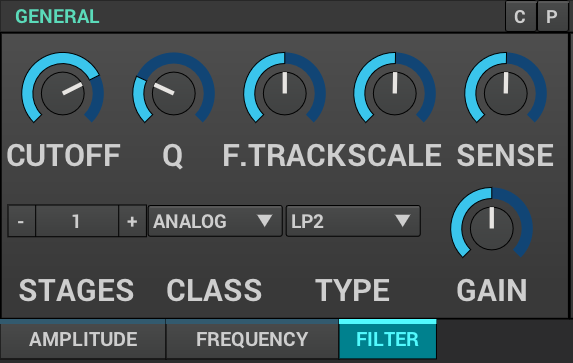
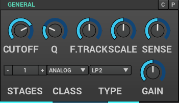
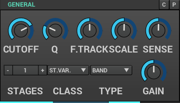
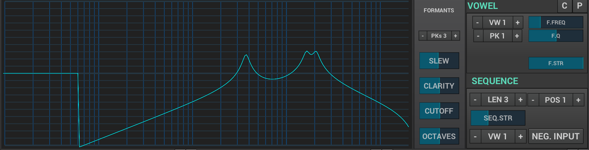
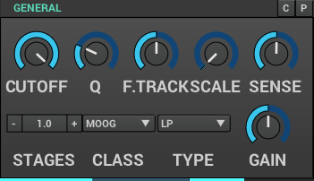
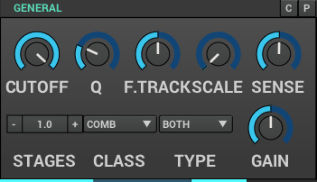

==== Filter Classes

Zyn-Fusion features three classes of filters.

State variable filters:: Limited filter types, but good under heavy modulation
Analog filters:: Standard Biquad formulations for a variety of shapes
Formant filters:: Good for modeling speech spectral shapes. Composed by many
sub-filters.
Moog filters:: Good for a warmer feeling - especially with some gain
Comb filters:: Good for string like effects or intense spectral and phase effects

===== Analog Filters

// fundamental, could you fill this in? - unfa

LP1:: One pole low pass
HP1:: One pole high pass
LP2:: Two pole low pass
HP2:: Two pole high pass
BP::  Bandpass
Notch:: Notch
Peak:: Peak
L.Shelf:: low shelf
H.Shelf:: high shelf

===== State Variable Filters

// fundamental, could you fill this in? - unfa

Low::  Two pole low pass
High:: Two pole high pass
Band:: Bandpass
Notch:: Notch

===== Formant Filter

The formant filter is a separate class on it's own.
It's a complex filter that will let you define presets of peak filters,
arrange them in a sequence and then smoothly interpolate between them.
This way you can apply very complex and animated filtering to shape the
harmonic profile of your sounds and make it evolve over time.
More on that later in this chapter.

===== Moog Filter

The Moog filter type is an attempt to emulate the renowned diode ladder filter found in classic Moog synthesizers. 
It employs the Zero Delay Feedback (ZDF) approach to ensure a level of accuracy in replicating the filter's behavior. 

LP:: low pass
HP:: high pass
BP:: Bandpass

===== Comb Filter

The Comb Filter operates as a tunable delay line, introducing a series of notches and peaks 
in the frequency spectrum due to the interaction between the original signal and its delayed version. 
The term "comb" aptly depicts the spectral pattern resembling the teeth of a comb, 
showcasing the alternating constructive and destructive interference patterns. 

This filter is commonly used to simulate various acoustic effects, such as reflections, 
chorus-like sounds, or enhancing the perception of spaciousness in audio signals.

BWD:: adds a delayed version of the output signal. the feedback structure leads to heavy resonance
FWD:: adds a delayed version of the input signal. the feed forward structure leads to more subtle phase effects
both:: combination of BWD and FWD. heavy resonances are dominant 
BWDN:: subtracts a delayed version of the output signal. similar to BWD. can be used for example to remove even harmonics
FWDN:: Subtracts a delayed input signal, emphasizing frequency cancellation for targeted harmonic removal or notching in the spectrum.
bothN:: Utilizes subtraction from both input and output signals

====== Poor Mans Physical Modelling
The comb filter can be used as a string like oscillator. 
To accomplisgh that apply it as voice filter to a burst of noise. 
But Make sure the amplitude envelope doesn't go too fast to zero as that would turn off the voice.
If F.Track is 100% it's frequencies are proportional to the pitch.
To keep in tune you may set Scale to 0 (no velocity impact) 
and enable "F. Ctl Bypass" in the voices Amplitude General Settings (no midi cc impact)

