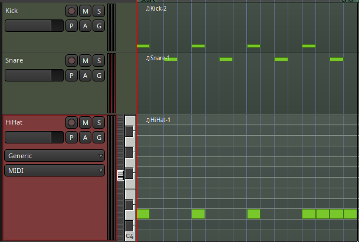
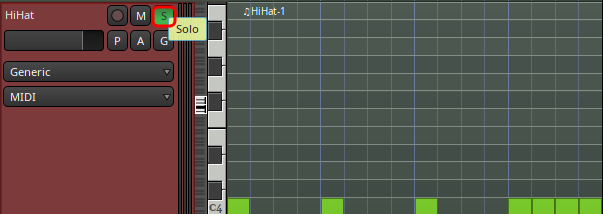
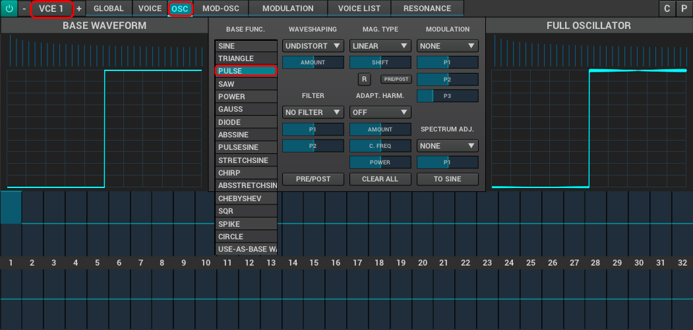
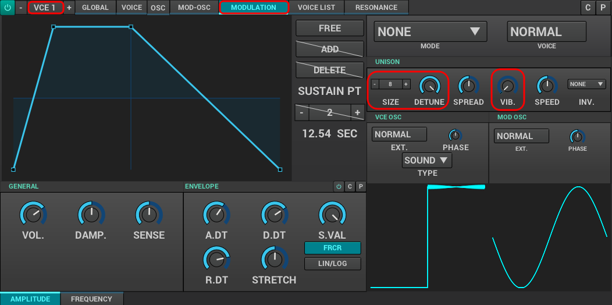

[[tut3]]
=== Tutorial 3: Hi-Hat Synthesis

In the previous sections you learned how to use the ADDsynth to create a kick drum and snare drum. Let's round out a ver basic drum kit with a hi-hat cymbal!

Many of the steps of this project are identical to the steps we took in our previous projects, but with different values.

Hopefully you have begun to feel comfortable enough with the general layout of Zyn-fusion to follow along with this project without us posting similar screenshots with slightly different values.

When you're finished with this project you'll know to:

- synthesize a custom snare hi-hat cymbal using ADDsynth and *envelopes* and *filters* and
- use modulator unison settings.

.Prerequisites
WARNING: This tutorial assumes that you have completed <<tut2, Project 2: Snare Drum Synthesis>>

.Open your previous Ardour session
Launch the Ardour session you used for <<tut2, snare drum tutorial>>.

.Add a new MIDI track
* Create a new Zyn-Fusion MIDI track for our synthesizer, using `Shift + Ctrl + N`
** *Name:* HiHat
** *Instrument:* ZynAddSubFX
** Click `Add and Close`

.Open the piano roll
Expand the track itself by clicking on the lower edge and dragging it down until you see the "piano roll" similar to the picture below.

.Draw your MIDI area
Enable draw mode by clicking on the pencil icon.

- Draw a MIDI area that is 1 *beat* / 4 *measures* long (it should be the same length as your existing kick and snare MIDI areas).

.Draw your MIDI pattern
I'm just going to place a simple 4/4 pattern. You can do anything you like, but don't get too crazy yet, it's going to be repeating behind you while you sculpt the sound.

.Info
NOTE: This tutorial uses note C4 as our starting note.

.Loop your MIDI pattern
Now we're going to tell Ardour to loop this specific region whenever we tell it to play. Right click on your MIDI area, select "play", and "loop region".

You should now here your pattern being played with your kick drum and the default Addsynth sound.

.Tip
NOTE: You can listen to any track in _solo_ mode by clicking on the `S` button on the specific track. This will mute all instruments but the track you select and can be useful when modifying individual sounds.

.Launch Zyn-Fusion
* Select your `Synth` track and then *double-click* on the ZynAddSubFX button (circled in red below)

.Launch ADDsynth
Launch the ADDsynth by selecting the `ADD` button.

.What Key am I in?
NOTE: We use note `C4` as our starting point.

.Change the Oscillator type
Up to this point we've been using the default sine wave oscillator to generate our tones, but Zyn-Fusion is capable of generating many different types of waves. Each type has unique sound characteristics that we'll dig into later.

For this project we're going to use a *Pulse* wave.

* Navigate to `VCE1 >> OSC`
** Adjust `Base Func >> Pulse`
*** How does the sound change between _pulse_ and _sine_?

.Adjust the Modulation
Now we're going to adjust how the signal is *modulated*. It's ok if you don't know what that means yet, for now think of "modulation" as "changing" a wave.

One of the unique characteristics of cymbals is the "rattle" or "crash" that can often sound like multiple clanging sounds overlapping. We're going to accomplish this goal by increasing the *unison*.

.Info
NOTE: Unison is used to create a chrous-like sound by playing multiple simultaneous oscillators.

* Navigate to `VCE1 >> Modulation`
** Adjust `Unison >> Size >> 8`
*** Pay attention to how the sound changes as you adjust the unison level(s)

Now let's adjust the *detune*. This modifies the amount of detuning between the multiple oscillators we defined above when we increased the unison. In other words, this setting controls how much difference between the oscillators.

Let's maximize the detune.

* Navigate to `VCE1 >> Modulation`
** Adjust `Detune >> 100%`

Now let's disable the default *vibrato* settings.
* Navigate to `VCE1 >> Modulation`
** Adjust `Vib >> 0`

.Modify the global frequency
Let's detune the frequency a bit again, this time at the global level.

* Navigate to `Global >> Frequency >> General`
** Adjust `BW >> 90`
*** How does the sound change when you adjust the frequency?

.Modify the global filter
Now it's time to play with filters where we will adjust, well, how the sound is filtered.

For starters, let's change from the default lowpass filter to a high-pass filter.

.Info
NOTE: A high-pass filter only allows frequenecies higher than the specified cutoff; all other frequencies are filtered out of our final sound.

* Navigate to `Global >> Filter`
** `Filter >> Type >> HP2`
*** How does the sound change?

Now let's adjust the cutoff frequency.

** `Filter >> Cutoff >> 14300 Hz`
*** 14300 is an approximate number, anything close should be fine.

.Modify the amplitude envelope
Listen to that! Believe it or not, we're almost finished. Let's try minimizing the sustain value to shorten the length of our note, I feel like it's dragging on far too long.

* Navigate to `Global >> Amplitude >> Envelope`
** Modify `S.VAL >> 0`

That's an interesting sound now, isn't it? What happens if we modify the *decay*?

* Navigate to `Global >> Amplitude >> Envelope`
** `Amplitude >> Envelope >> D.DT >> 30`

.Tip
NOTE: If the hi-hat seems hard to hear when playing with your kick and snare, try increasing the `GLOBAL >> AMPLITUDE >> VOL` of the hi-hat.

.Save your instrument
Congratulations, you've crafted a hi-hat cymbal - starting with a single sin wave and using additive synthesis!

Now would be a great time to save your Zyn-fusion instrument and Ardour session.

* Navigate to `File >> Save instrument`
* Choose a directory and name your file before selecting `Enter`

.Save your Ardour session

* Navigate to your Ardour window
* `Ctrl + S`
