In the previous section you learned how to load and use existing patches, but the real power of ZynAddSubFX is the ability to create new sounds and adjust existing sounds to harmonize with the rest of the instruments. Now that you know how to load and use existing patches, let’s take a look at how to build new patches.

When you're finished with this project you'll know to:

- use the Ardour piano roll to write a basic midi pattern
- use Ardour to loop a basic midi pattern
- synthesize a custom kick drum using ADDsynth and *envelopes*, *filters*, *and LFOs*

.Prerequisites
WARNING: This tutorial assumes that you have completed the Quick Start guide _or understand the content presented within it_.

==== Open your previous Ardour session
// Links to Introduction.adoc:Quick start
Launch the Ardour session you created for the <<quick-start, Quick start guide>>.

==== Add a new MIDI track
* Create a new Zyn-Fusion midi track for our synthesizer
** `Shift + Ctrl + N`
*** *Name:* Kick
*** *Instrument:* ZynAddSubFx
*** Click `Add and Close`

image::screenshots/ardour-new-track.png[]

==== Open the piano roll
Expand the track itself by clicking on the lower edge and dragging it down until you see the "piano roll" similar to the picture below.

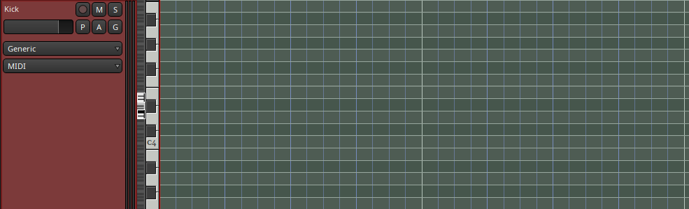

==== Draw your MIDI area
- Enable draw mode.

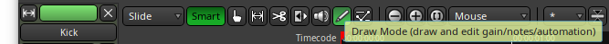

- Draw a midi area that is 1 *beat* / 4 *measures* long. Don't worry if you don't know what that means, you can just draw from the `1` to the `2` following the `Bars:Beats` bar. See the image below.

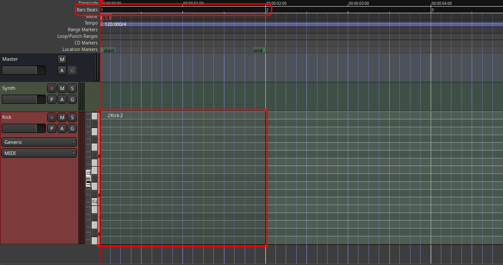

==== Draw your midi pattern
I'm just going to place a simple 4/4 pattern. You can do anything you like, but don't get too crazy yet, it's going to be repeating behind you while you sculpt the sound.

image::screenshots/ardour-midi-4-4-pattern.png[]

This tutorial uses note A4 as our starting note. You can press the `Y` key on your QWERTY keyboard to hear it.

==== Loop your midi pattern
Now we're going to tell Ardour to loop this specific region whenever we tell it to play. Right click on your midi area, select "play", and "loop region".

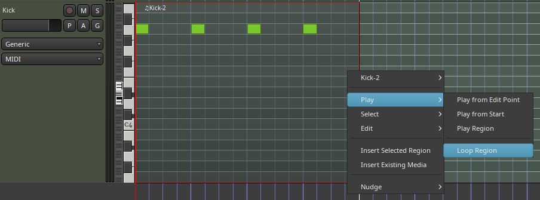

You should now here your pattern being played using the default Zyn-fusion synthesizer. Let's transform it into a kick drum.

==== Launch Zyn-Fusion
* Select your `Synth` track and then *double-click* on the ZynAddSubFX button (circled in red below)

image::screenshots/ardour-launch-zyn-fusion.png[]

==== Launch ADDsynth
Launch the ADDsynth by selecting the `ADD` button.

image::screenshots/launch-ADDsynth.png[]

.What Key am I in?
NOTE: We use note `A4` as our starting point. You can press the `Y` key on your QWERTY keyboard to hear this note.

==== Lower the octave
By the the repetive beeping has probably started to bother anyone within listening distance, yourself included. Let's drop it a bit and get it closer to the sound we're looking for.

* Navigate to Global >> Frequency
* Adjust the General >> Octave to `-3`
** What do you notice about how the sound has changed?
** How has it changed?

image::screenshots/global-freq.png[]

_Note that the image above shows a different octave but is for demonstration purposes only; set it to the `-3` value described in these steps please._

==== Modify your amplitude envelope
Very briefly, envelopes allow us to define how a note behaves over its lifetime. We use an acronymn full of jargon when discussing this behavior - *ADSR*.

.ADSR
NOTE: ADSR stands for Attack, Decay, Sustain, Release.

You don't need to worry about these terms if you don't already know them, we'll cover them in more detail later.

We're going to shorten the *Release* of the Global amplitude envelope, or in simpler terms, let's make the note "shorter".

* Adjust `R.DT` to `63`. 
** What do you notice about how the sound has changed?
** Can you hear a new `clicking` sound?

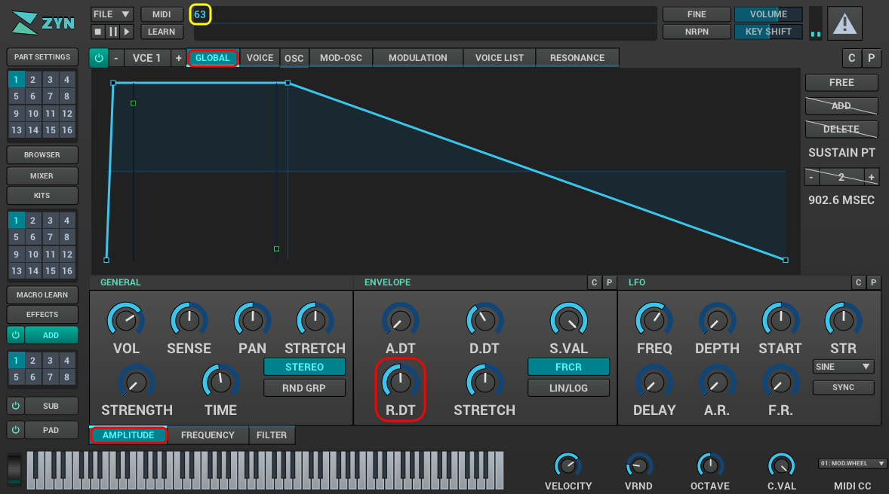

By now it should be resembling something approaching the sound of a kick drum.

.TIP
NOTE: Notice the area outlined in yellow below, it will display the value of the knobs/dials you manipulate.

==== Modify your frequency envelope
Now lets adjust the frequency of our sound a bit to give it a bit more "bounce" by adjusting the *Attack Value*.

* Adjust `A.VAL` to `107`
** What do you notice about how the sound has changed?

It's getting closer! Let's add a little more depth to the sound by extending the *Attack Time*.

* Adjust `A.DT` to `70`
** What do you notice about how the sound has changed?

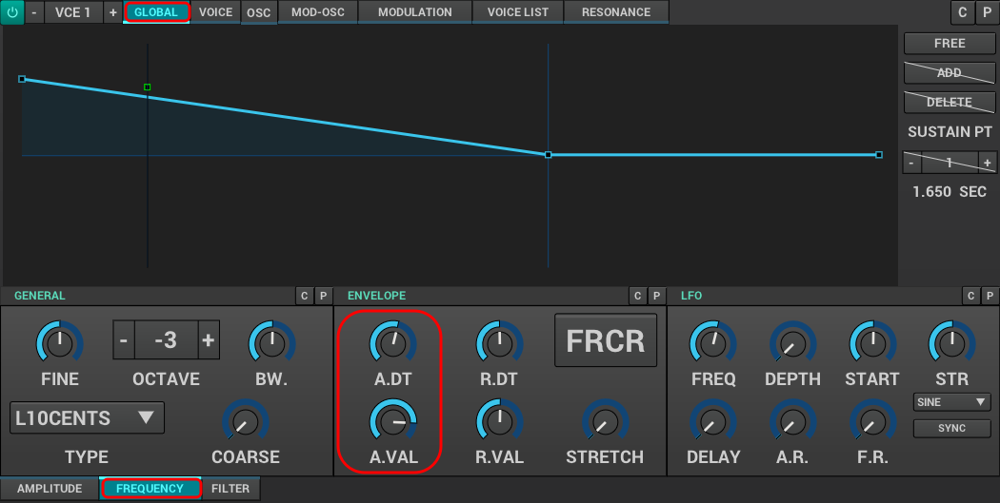

It sounds more like a drum now but not quite the _deep_ sound we're looking for in a kick. 

.Quiz Time
NOTE: Knowing what you've learned so far, how you attempt to literally _drop the bass_ at this point?

Take some time to think about it, I'm not in a rush. Seriously, I'll grab a cup of coffee while you think it over.

...

There's likely an inifinite number of ways to approach this, but let's stick to a simple method we employed earlier - lowering the octave!

* Adjust `Octave` to `-4`

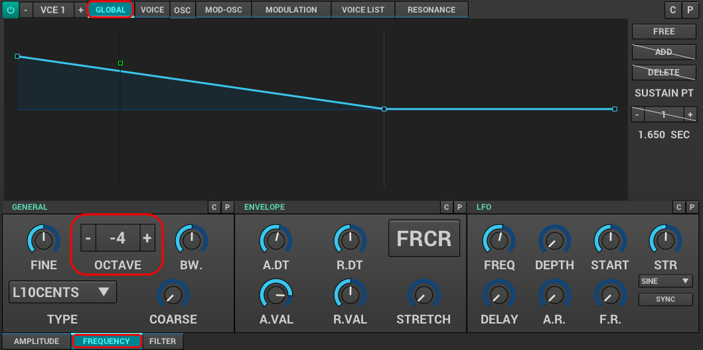

Ah, now that's starting to sound like a decent kick drum!

.TIP
NOTE: The volume of your kick may seem a bit low after dropping the octave to -4. You can always increase it a bit using the `Global >> Amplitude >> Vol` knob.

==== Make the sound more dynamic by adding a second voice
You can think of each *voice* as another layer that gets applied when crafting you sound. More layers result in more complexity but the potential of a richer fuller sound with more natural harmonics.

Let's try adding a second voice and see how it affects our kick drum.

* Navigate to `VCE 2` by clicking the `+` beside `VCE 1`

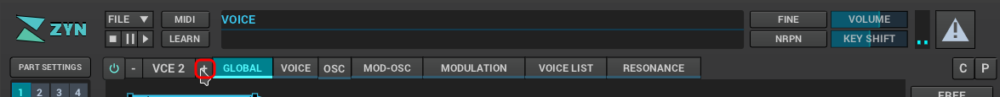

* Enable `VCE 2` by clicking on the power button. 
** Try enabling/disabling it a few times and listen to the difference.
** What do you notice about how the sound changes when the second voice is enabled?

==== Add some noise
One thing you may have noticed by now is that every single hit sounds _identical_. This isn't necessarily a bad thing, but it can lead to boring sounds. 

Let's try adding some *noise* to this voice so that every hit will include a bit of randomness.

* Navigate to the modulation tab
* Find the `VCE OSC` block and adjust the `Type` from `sound` to `pink`.
** What do you notice about how the sound has changed?

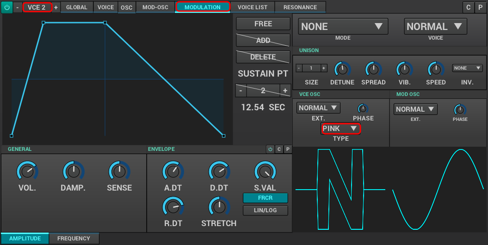

==== Apply a filter
Now we have too much noise drowing out our primary kick sound.

We can use *filters* to filter out specific frequency ranges. In this case, let's use the default *lowpass* filter (lp2) to remove most of the high pitched sound that is drowing out our kick drum.

The goal is to leave just enough of the noise underneath the primary kick sound to add more depth and a bit of variety to each hit. 

* Navigate to the `VCE 2 >> Filter`
* Enable the filter
** What do you notice about how the sound changes?

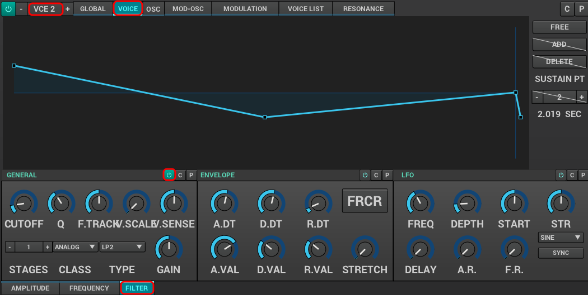

* Adjust `Cutoff` to `80Hz`
** What do you notice about how the sound changes?

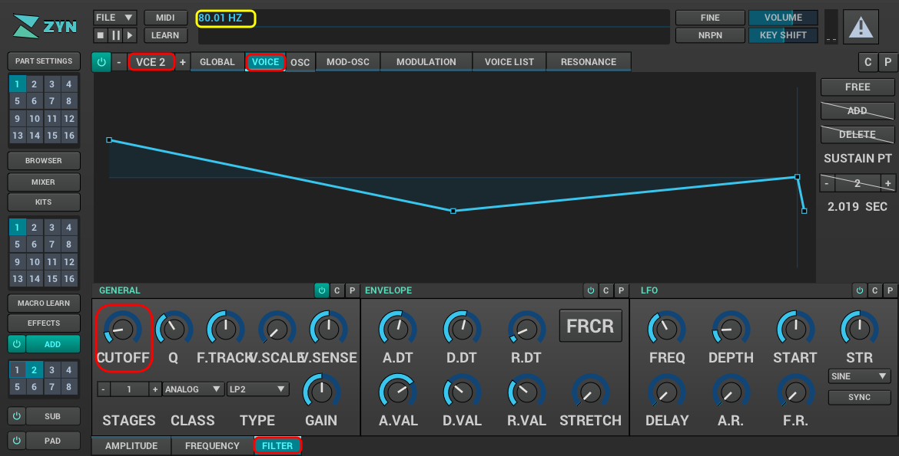

Almost there. It's sounding somewhat like a heartbeat now, a bit too echoey. Lets try adjusting the *Quality Factor* to clean it up a bit.

* Adjust `Q` to `.3`
** What do you notice about how the sound changes?

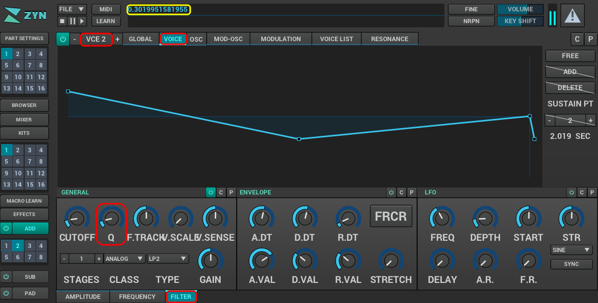

.TIP
NOTE: You can temporarily disable `VCE 1` so that you can listen to `VCE 2` in isolation to get a clearer picture of what it's adding. To disable a voice you can simply use the `+/-` button to navigate to the voice and then click the power button so that it's greyed out. (The opposite of how you added `VCE 2` above)

==== Save your instrument
Congratulations, you've crafted a kick drum - starting with a single sin wave and using additive synthesis!

Now would be a great time to save your Zyn-fusion instrument and Ardour session.

* Navigate to `File >> Save instrument`
* Choose a directory and name your file before selecting `Enter`

image::screenshots/save-instrument.png[]

==== Save your Ardour session

* Navigate to your Ardour window
* `Ctrl + S`
