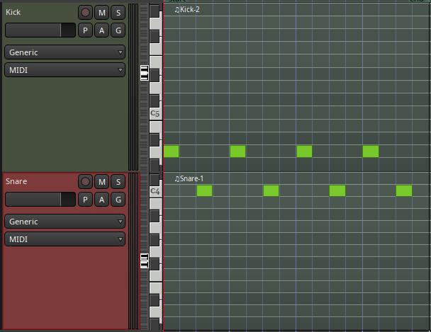
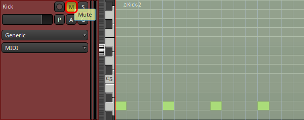

[[tut2]]
=== Tutorial 2: Snare Drum Synthesis

In the previous section you learned how to use the ADDsynth to create a kick drum. Let's build on what you learned to create a simple snare drum.

Many of the steps of this project are identical to the steps we took in our first project to create our kick drum, but with different values.

Hopefully you have begun to feel comfortable enough with the general layout of Zyn-fusion to follow along with this project without us posting similar screenshots with slightly different values.

When you're finished with this project you'll know how to
synthesize a custom snare drum using ADDsynth and *envelopes* and *filters*.

.Prerequisites
WARNING: This tutorial assumes that you have completed <<tut1, Project 1: Kick Drum Synthesis>>

.Open your previous Ardour session
Launch the Ardour session you used for the <<tut1, kick drum tutorial>>.

.Add a new MIDI track
* Create a new Zyn-Fusion MIDI track for our synthesizer, using `Shift + Ctrl + N`
** *Name:* Snare
** *Instrument:* ZynAddSubFX
** Click `Add and Close`

.Open the piano roll
Expand the track itself by clicking on the lower edge and dragging it down until you see the "piano roll" similar to the picture below.

.Draw your MIDI area
Enable draw mode by clicking on the pencil icon.

- Draw a MIDI area that is 1 *beat* / 4 *measures* long. Don't worry if you don't know what that means, you can just draw from the `1` to the `2` following the `Bars:Beats` bar.
// See the image below.
// TODO: No image here!

.Draw your MIDI pattern
I'm just going to place a simple 4/4 pattern. You can do anything you like, but don't get too crazy yet, it's going to be repeating behind you while you sculpt the sound.

.Info
NOTE: This tutorial uses note C4 as our starting note.

.Loop your MIDI pattern
Now we're going to tell Ardour to loop this specific region whenever we tell it to play. Right click on your MIDI area, select "play", and "loop region".

You should now here your pattern being played with your kick drum and the default Addsynth sound.

.Tip
NOTE: You can mute the kick drum at any time by selecting the `M` button on the Ardour kick track.

.Launch Zyn-Fusion
* Select your `Synth` track and then *double-click* on the ZynAddSubFX button (circled in red below)

.Launch ADDsynth
Launch the ADDsynth by selecting the `ADD` button.

.What Key am I in?
NOTE: We use note `C4` as our starting point.

.Raise the volume
Snares are meant to be heard, let's turn ours all the way up.

* Navigate to `Global >> Amplitude`
** Adjust `Volume` to 100%

.Open up the global filter
A snare generates a wide range of frequncies so let's open the global filter all the way up to let all frequencies through.

* Navigate to `Global >> Filter`
** Adjust the `General >> Cutoff` to 100%

.Modify your amplitude envelope
We're going to shorten the *Release*, *Sustain*, and *Decay* of the amplitude envelope for voice 1, or in simpler terms, let's make the note  have a "shorter" more percussive sound.

* Navigate to `VCE1 >> Voice >> Amplitude >> Envelope`
** Enable it by pressing the grayed out power button until it lights up.
** Adjust `R.DT` and `S.DT` to `0`.
** Adjust the `D.DT` to `32`

.Lower the octave
Now that we have a short percussive sound, let's lower the octave of `VCE 1` so that it's something closer to the hit of a snare drum.

* Navigate to `VCE1 >> Voice >> Frequency`
** Adjust the `Octave` to `-2`

.Modify your frequency envelope
Now lets adjust the frequency of our sound a bit to give it a bit more "bounce" by adjusting the *Attack Value*.

* Navigate to `VCE1 >> Voice >> Amplitude >> Envelope`
** Adjust `A.VAL` to `110`

Let's add a little more length to the sound by extending the *Attack Decay* time.

* Navigate to `VCE1 >> Voice >> Amplitude >> Envelope`
** Adjust `A.DT` to `25`

.Use a second voice to add the snare "sizzle"
Now that we've got a basic _thwacking_ percussive sound that is similar to a snare drum it's time to add the _sizzle_ that is created by the metallic snare wires.

* Navigate to `VCE 2` by clicking the `+` beside `VCE 1`
* Enable `VCE 2` by clicking on the power button.

.Enable noise modulation
We're going to add some noise much like we did when creating our kick drum previously, only this time we're going to use `white` noise instead of `pink`.

.Tip
NOTE: Don't worry if you don't know the difference between white and pink noise, we'll cover that later. For now, feel free to alternate between them and see what differences you can notice.

* Turn on the noise
** `VCE 2 >> Modulation >> VCE OSC >> Type >> White`

Now you may notice that the noise is too loud compared to the smack of our drum. Let's turn down the second voice a bit so it sits properly beneath the primary thwacking sound.

* Lower the volume of this voice
** Navigate to `VCE 2 >> Amplitude >> General >> Vol`
** Adjust `Vol` to `100`
*** Note that this means the actual value of 100, not 100%.

.Enable amplitude envelope
Now that we've set a decent volume between the _thwack_ and the _sizzle_ of the sound, let's adjust the amplitude of the noise generated by VC2 to match that of VCE1.

* Navigate to `VCE1 >> Voice >> Amplitude >> Envelope`
** Enable it by pressing the grayed out power button until it lights up.
** Adjust `R.DT` and `S.DT` to `0`.
** Adjust the `D.DT` to `32`

.Save your instrument
Congratulations, you've crafted a snare drum - starting with a single sin wave and using additive synthesis!

Now would be a great time to save your Zyn-fusion instrument and Ardour session.

* Navigate to `File >> Save instrument`
* Choose a directory and name your file before selecting `Enter`

.Save your Ardour session

* Navigate to your Ardour window
* `Ctrl + S`
