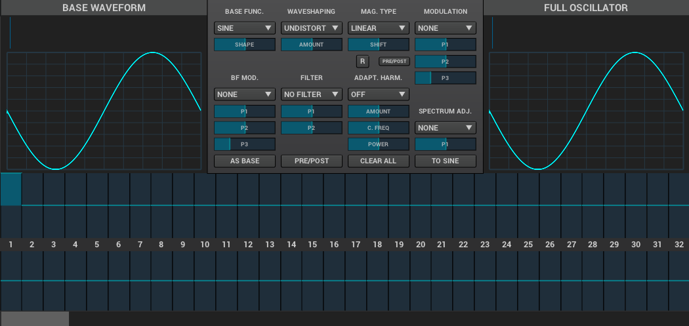
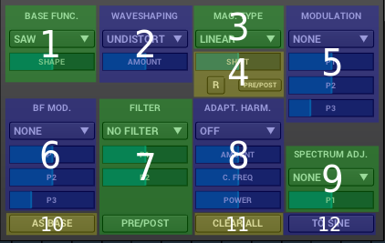

= __Zyn-Fusion User Manual__

NOTE:: This document is work-in-progress and is far from completion.

NOTE: TESTING PUSH

---

== Introduction

=== What is Zyn-Fusion?

Zyn-Fusion is a powerful, modern, multiplatform, open-source software sound synthesizer. Zyn-Fusion is a successor to ZynAddSubFX, bringing in a new graphical user interface, and improved backend. It can work as a standalone application, or as a VST, LV2 or DSSI plugin.

TODO:: anything else?

=== Main features

TODO:: Maybe it's not a good idea to repeat the feature list from the main page? Or maybe it's a good idea to try to update that instead

* Zyn-Fusion is actually three synthesizers in one box - they can play together
* multitimbral: can play multiple patches at once using different MIDI channels, or simply layer then together for complex sounds
* we can layers sounds like no one else (parts, kits, ddsynth voices, multiple engines)
* Built in effects
* 16 macro slots for automation or live control - everything can be automated (unlike the old ZynAddSubFX interface)

== User interface

=== User interface conventions

TODO:: describe app-wide patterns that the user should know to work more efficiently

There are a few standard types of controls (provide screenshot for each)

* Buttons
* Sliders
* Knobs
* Number fields
* anything else?

Holding down Ctrl will temporarily activate Learn mode - any control touched will be assigned to a macro.
Holding down Shift will temporarily activate Fine mode - this will greatly increate the input resolution allowing for more precise manipulation.

The knobs and sliders can be reset to their default position with a double-click or a middle-mouse-click.

=== Panels
When you run Zyn-Fusion you'll be presented with this window:

image::imgs/20180328-183524.png[]

As you can see it is divided into multiple panels.

TODO:: list the panels and briefly explain their function

* top panel
* bottom panel
* main panel
* side bar

TODO:: Then we'll split up each into parts and describe what each part does in detail, covering every button and field. When a button opens Ia dialog of another window. For example clicking on the the logo opens up settings - we can branch out and cover that in a different section if it's approperiate. For example a chapter about Zyn preferences and simply say "here are user preferences - more on that in chapter X"

==== Top Panel

* Logo
* File menu
* Audio capture controls
* MIDI and Learn buttons
* Information bar
* Fine control toggle
* NPRN button
* global volume nad key shift controls
* master level meter
* Panic button

=== Bottom Panel

* Virtual keyboard (also usable with QWERTY keaboard - that;s important!)
* Virtual keyboard knobs
* MIDI CC selector (can we use this to with that pitch bend? can we fake MIDI CC input for Macro learn?)

=== Main Panel

Here's where the most of the action happens.
When you start Zyn-Fusion it'll begin by showing you the Browser.
Use the Side Bar to slelect what should be displayed here.

There's not much to say about this region of the interface, becasue it's looks and functions will vary wildly based on the context, which leads us to talking about the...

=== Side Panel

The side panel is used to navigate between different parts of the user interface.
Whatever you'll activate here will be opened in the Main Panel.

* Part settings
* Part Grid (LMB- select, MMB - enable/disable)
* Browser
* Mixer
* Kits
* Kit Grid (mouse actions same as with Part Grid)
* Macro Learn
* Effects
* Addsynth
* Addsynth Voice Grid
* Subsynth
* Padsynth

=== Modules

As you probably know, synthesizers are built from modules. Oscillators, filters, envelope generators, amplifiers... These are all building blocks that put together in a certian way make a (hopefully) musical instrument.

Zyn-Fusion is no different. Let's talk about various types of modules that you'll encounter exploring Zyn-Fusion. If you take some time to familiarize yourself with these - you'll have a much easier time finding your way through the interface for each of the synthesizing engines found in Zyn-Fusion, as you'll recognize different modules and their functions.

==== Oscillator module

This module creates cyclic waveforms. You might feel intimidated by how complex this thing looks. But don't worry - we're gonna break it down and you'll realize it's not very complicated.

The oscillator module comprises of four main sections:

* Two big waveform displays,
* A bunch of controls between the two,
* An array of sliders on the bottom.

===== Base Waveform display

On the left side you'll see the base function used for the oscillator. You can change that by using the Base Func. dropdown menu and it's Shape slider.

===== Partials

The slider table on the bottom is a list of harmonic partials. You'll notice that by default only the first one on the left is activated. That's the firt partial, also known as the fundamental, the second slider adds a copy of the Base Waveform, but at twice the frequency as the fundamental. The thirds slider is the same but for 3 times the frequency fo the fundamental etc. The top for of sliders defines amplitude of each partial, the bottom for defines the phase offset. Below the bottom row of phase offset sliders is a scroll bar that will let you access more partials, up to 127.

===== Full Oscillator display

As opposed to the Base Waveform, this displays your final waveform that will be produced by the oscillator module.

===== Oscillator controls

Now let's dismantle this mysterious section in the middle:

==== Filter module

TODO:: add a screenshot
