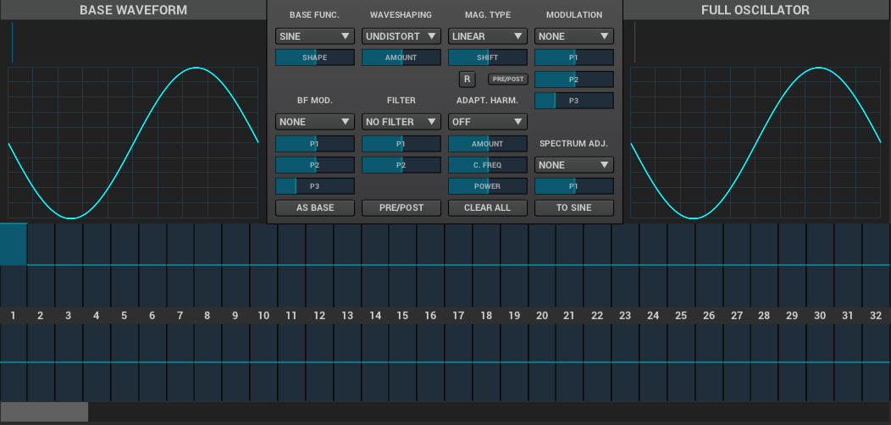
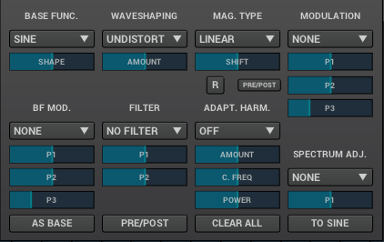

This module creates cyclic waveforms. You might feel intimidated by how complex this thing looks. But don't worry - we're gonna break it down and you'll realize it's not very complicated.

The oscillator module comprises of four main sections:

* Two big waveform displays,
* A bunch of controls between the two,
* An array of sliders on the bottom.

==== Base Waveform display

On the left side you'll see the base function used for the oscillator. You can change that by using the Base Func. dropdown menu and it's Shape slider.

==== Partials

The slider table on the bottom is a list of harmonic partials. You'll notice that by default only the first one on the left is activated. That's the first partial, also known as the fundamental, the second slider adds a copy of the Base Waveform, but at twice the frequency as the fundamental. The thirds slider is the same but for 3 times the frequency fo the fundamental etc. The top for of sliders defines amplitude of each partial, the bottom for defines the phase offset. Below the bottom row of phase offset sliders is a scroll bar that will let you access more partials, up to 127.

==== Full Oscillator display

As opposed to the Base Waveform, this displays your final waveform that will be produced by the oscillator module.

==== Oscillator controls

Now let's dismantle this mysterious section in the middle:

