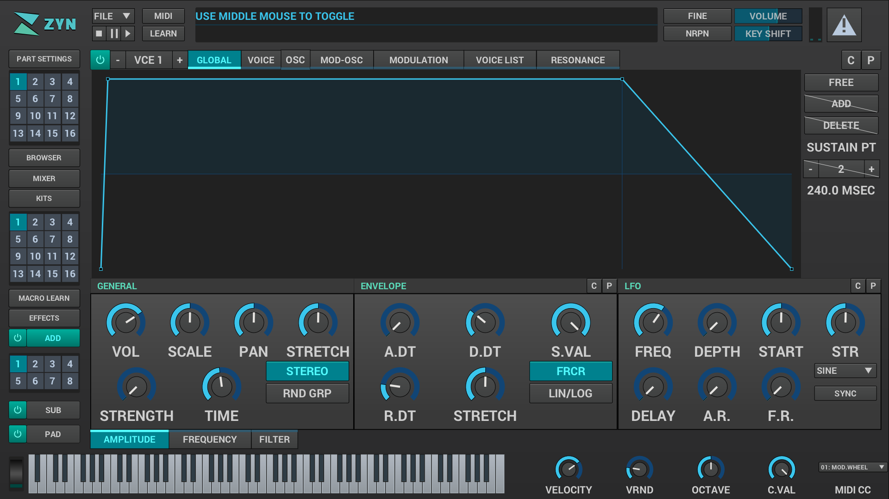
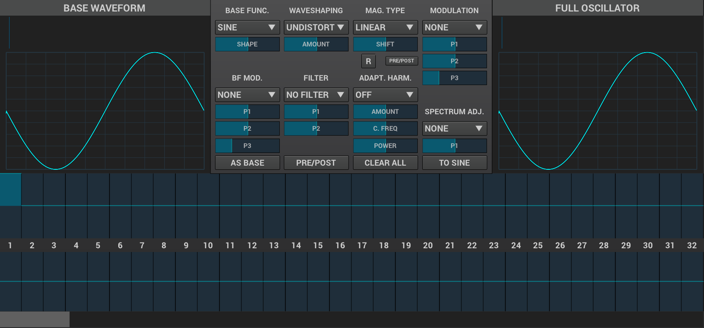
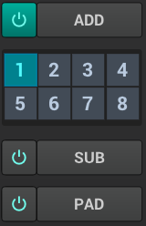
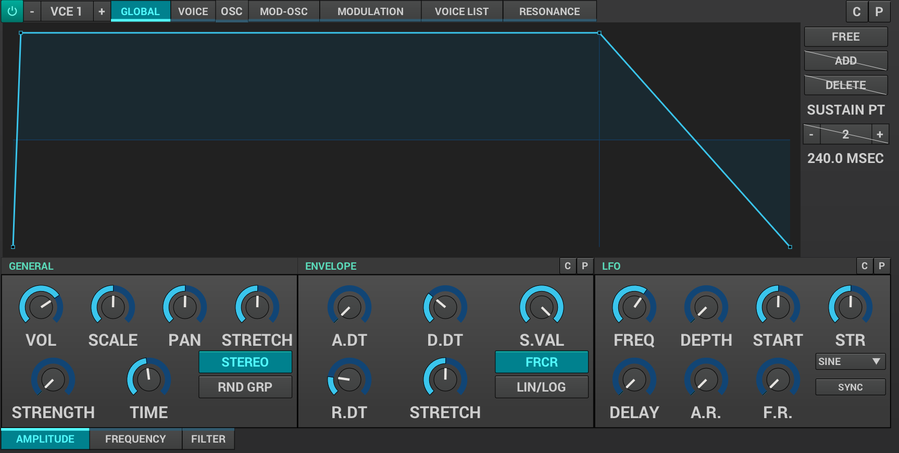
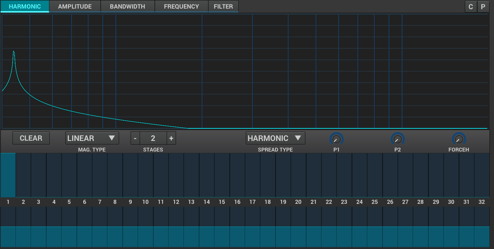
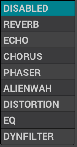
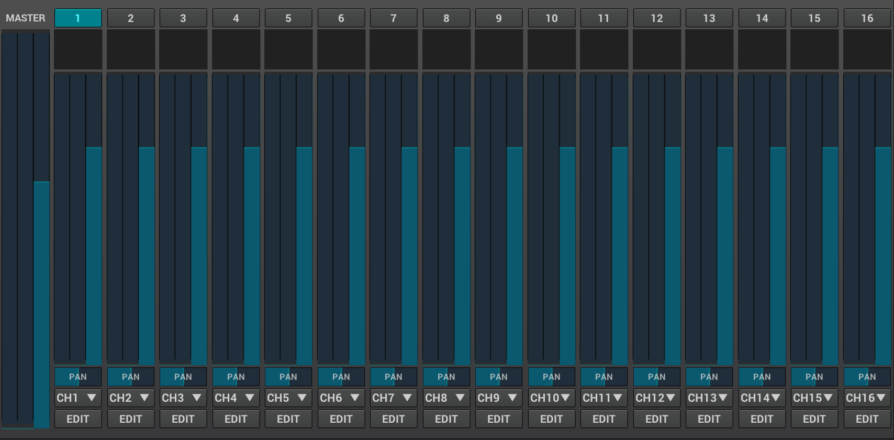
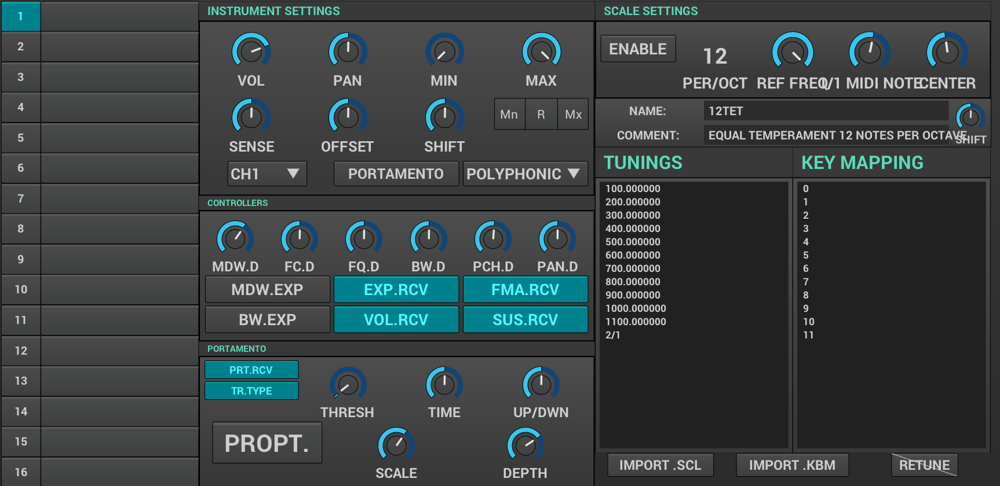
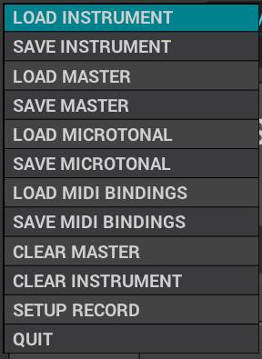
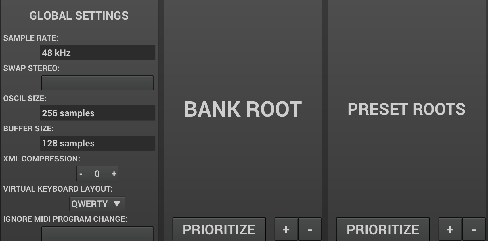

== Overview
==== a broad look on all the topics of the user manual
*This document serves as a quick reference to what needs to be covered and in what order. It's also a way to make sure we didn't miss anything and that the manual is structured well.*

---

* Introduction (what is Zyn-Fusion)

* Main Features

* User Interface
	- Conventions
	- copy/paste
	

	- UI elements
	- UI Layout

	- What all panels do
	
* Synthesizer modules
	- oscillator

	
		- the module UI layout
		- controls
		- list of base functions and their behaviour
	- filter

image::imgs/20180413-143939.png[]
		- Filter Classes

image::imgs/20180413-143956.png[]
		- Analog Filter Types

image::imgs/20180413-144027.png[]
		- State Variable filter types

image::imgs/20180413-144058.png[]
		- Formant filter

image::imgs/20180413-144131.png[]
	- envelope

image::imgs/20180413-144343.png[]
		- ADSR
		- Free mode
	- LFO

image::imgs/20180413-144358.png[]
	- amplifier (?)

image::imgs/20180413-144157.png[]
		- vol
		- scale
		-pan
		-stretch
		- punch strength and time
	- pitch control

- Synthesis engines

	- addsynth

		- what is Addsynth and why it's named this way?
		- signal routing diagram (maybe better to leave that for Appendix A?)
		- global settings
		- voice
		- osc
		- mod-osc
		- modulation
		- voice list
		- resonance
		
	- subsynth

		- what is subsynth and why it's named this way?
		- signal routing diagram (maybe better to leave that for Appendix A?)
		
	- padsynth

image::imgs/20180413-145036.png[]
		- what is padsynth and why it's named this way?
		- signal routing diagram (maybe better to leave that for Appendix A?)

- Effect processors
Zyn has a set of built-in effect processors
(go through all effect processors and their settings)

- Effect slots
the effects can be used in three different places in Zyn-Fusion

	- system
	- insertion
	- part insertion

- Parts
	- Basics: Zyn is multitimbral, can play on 16 MIDI channels
	- part selection grid (in the side panel)
- Mixer

* Part settings

	- selecting, enabling/disabling, renaming
	- Instrument Settings
	- Controllers
	- Portamento
	- Scale settings
	
* Kits
	- what are these and how to use them
	- what is "no kit/ multi kit/single kit"?
	- what is drum mode?
	
* Macro Learn
	- what is it
	- how to use it
	- using it for live operation
	- using it for DAW automation

- FIle menu
	- XMZ vs XIZ

	

- recording audio files

-  Settings

* Appendix A:
	Global signal routing diagram

* Appendix B:
	Glossary
	