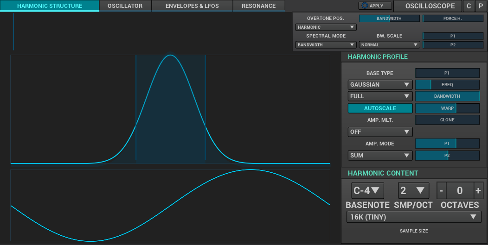

=== PADSynth

PADSynth is a very unique synthesis engine.
It works by taking a sound you've made with the <<synth-osc, oscillator>>
and then spreading that sound across a wide harmonic range,
which leaves you with a harmonically rich variant of the original sound you made.

This synth requires hiting the "Apply" button each time you make a change,
to save the wave of the sound.

After editing your oscillator, and adding resonance if necessary,
we can move onto the main part of the PADSynth interface, which is the "Harmonic structure" tab.

Here, you can change the harmonic distribution curve, bandwidth and saved wave properties.
You'll mainly be messing with bandwidth and the curve, however!

After editing the timbre of your sound, you can move onto the "Envelope & LFOs" tab, where you can once again edit
the <<synth-ampset, amplitude>> and <<synth-freqset, frequency>>,
as well as the optional <<synth-res, resonance>> and <<synth-filset, filter>>.

// TODO: Signal routing diagram
// TODO: Tutorials
