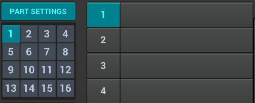

* [x] Part settings - among other things - let you determine how the part will respond to incoming MIDI data. Settings like MIDI channel, mono/poly/legato or portamento reside here. Here you can also define a custom microtonal tuning.

TODO:: Anything more?

Recap of what are parts and why we love them so much.

* [ ] Selecting parts

* [ ] Naming parts

* [ ] Instrument settings

image::imgs/Selection_424a.png[]

* [ ] Controllers

image::imgs/Selection_425.png[]

* [ ] Portamento

image::imgs/Selection_426.png[]

* [ ] Scale Settings

image::imgs/Selection_427.png[]

* [ ] Tunings and Key mapping

image::imgs/Selection_428.png[]