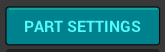
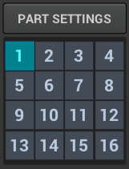
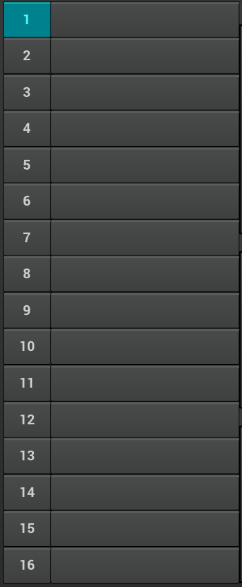
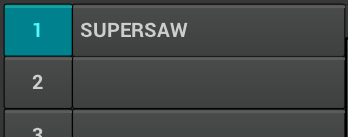
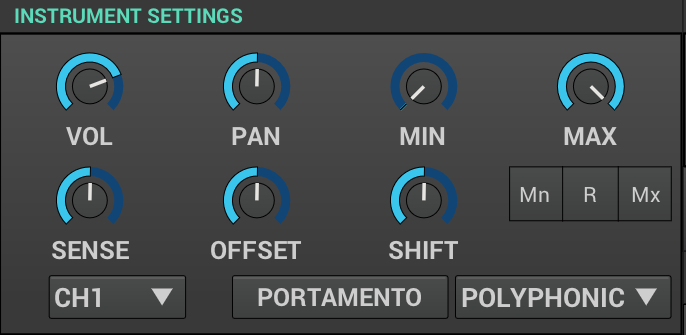
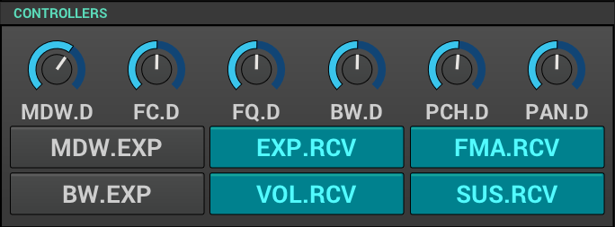
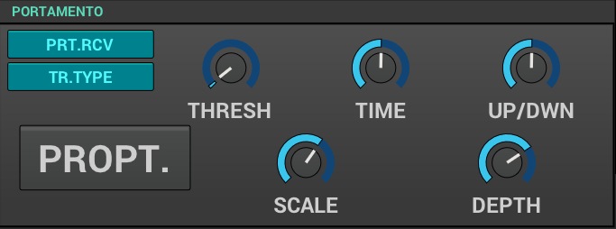
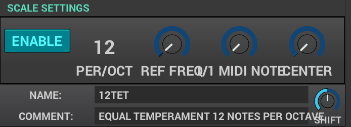
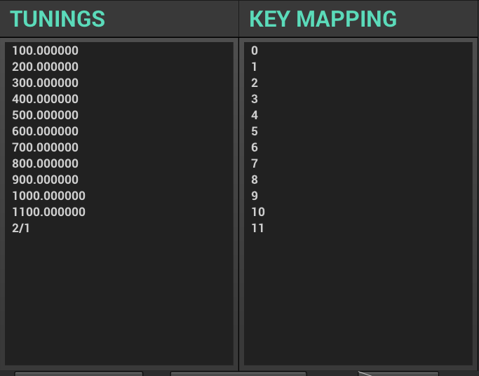

=== Introduction

Part settings - among other things - let you determine how the part will respond to incoming MIDI data. Settings like MIDI channel, mono/poly/legato or portamento reside here. Here you can also define a custom micro-tonal tuning or split the keyboard between different parts.

// Anything more?

// Put here a recap of what are parts and why we love them so much? - unfa

=== Accessing the Part Settings

To access the part settings, click on the "Part Settings" button in the sidebar

=== What are parts?

ZynFusion is a multi-timbre synthesizer - that means it can perform with multiple patches (timbres) at the same time. All 16 parts function independently and by default respond to respective MIDI channels. Sound output from all part is mixed to a stereo sum.

=== Selecting and enabling Parts

==== Grid dial

You can select and enable/disable parts using the grid dial below the "Part Settings" button:

Left-click will select the chosen part and let you interact with it. Middle-click will enable/disable the chosen part.

==== Part List

When you open up the Part Settings panel, you'll see a list of all parts on the left side:

Clicking on a button with a Part's number will enable/disable that part. Clicking in the empty name fileds will select a part and bring up it's parameters in the rest of the panel.

You can also type in a name for your part here.

==== Mixer

Parts can be viewed, enabled and renamed also in the Mixer view. More in the <<Mixer>> chapter.

// Let's cover the mixer in another part and add a working link here

=== Naming parts

Each part has a unique number, which cannot be changed, but can also be assigned a name. It's useful to name your parts when using more than one to keep thinkgs organized.

To name a part, just click in the Part List and type in a name:

Tjhe name will be displayed in the Par List, and in the Mixer.

=== Instrument settings

=== Controllers

=== Portamento

=== Scale Settings

=== Tunings and Key mapping

