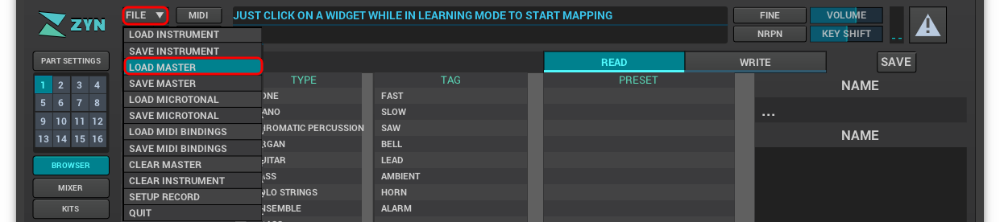
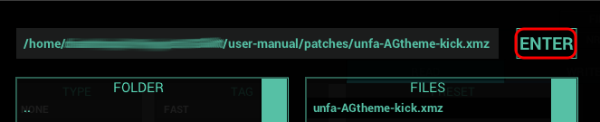
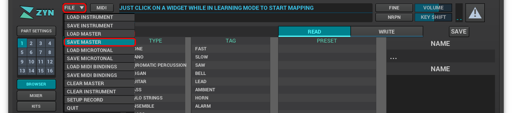
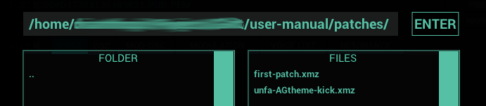

=== Goals
*This quick-start will guide you through the process of using Ardour to launch Zyn-Fusion and then using Zyn-Fusion to open an existing patch and modify it.*

Don't worry if some or most of these terms are unfamiliar, we'll cover them soon but for now we want to get you having fun making sounds!

When you're finished with this project you'll learn some fundamentals such as:

* _How to use Ardour sessions to save/restore work_
* _How to create Ardour tracks_
* _How to use Zyn-Fusion as a plugin from inside Ardour_
* _How to open and save an existing patch_
* _How to perform basic sound manipulation on an existing patch_

.Prerequisites
WARNING: This guide expects that you are starting with a working installation of Ardour and Zyn-Fusion; at a minimum you should be able to play and hear the Ardour metronome to confirm that your audio is routed properly.

==== Create your Ardour session
.If Zyn-Fusion can be used as a standalone tool why are we using it with Ardour?
NOTE: We're choosing to use Ardour primarily for it's session handling, ensuring that we can save and return to our progress at any time.

===== Start a new session
* Launch Ardour and create a new session using the _Empty Template_
** I named mine *QuickStart* but you can choose any name you'd like

===== Add your first track
* Create a new Zyn-Fusion midi track for our kick drum
** `Shift + Ctrl + N`
*** *Name:* Kick
*** *Instrument:* ZynAddSubFx
*** Click `Add and Close`

image::screenshots/ardour-new-track.png[]

===== Launch Zyn-Fusion
* Select your `Kick` track and then *double-click* on the ZynAddSubFX button (circled in red below)

image::screenshots/ardour-launch-zyn-fusion.png[]

===== Play the default ADDsynth
The ADDsynth is an additive synthesizer. It's totally fine if you don't know what that means yet.

You can launch it by selecting the `ADD` button. Try launching it and then playing a few notes by pressing some keys on your keyboard. You should see the corresponding key light up on the virtual keyboard. Listen to the default sound or "voice" of the ADDsynth. 

image::screenshots/launch-ADDsynth.png[]

Next try playing around with the virtual keyboard at the bottom of the window.

image::imgs/virtual-keyboard.png[]

===== Open an existing patch

.What is a patch?
NOTE: For now think of a patch as a saved Zyn-Fusion configuration. Once you create a sound you like, you can save the configuration as a _patch_ which can be shared or reloaded to recreate this sound in the future.

Now that you've heard what the default ADDsynth sounds like, let's hear an example of what sounds can be made with it, starting with one of Unfa's kick drum patches.

.TODO
WARNING: We need to include info here for a link to download the patch from. Should we include it in this repo?

Click on the `File` drop down that is to the right of the Zyn logo and select `Load Master`.

Navigate to the `.xmz` patch file you downloaded earlier and select `Enter`.

Try playing the synth again after loading the patch. (I personally like the `R`, `T`, and `Y` keys on my keyboard with this patch).

===== Modify an existing patch
Now let's try experimenting with some knobs and dials to see how you can modify the sound.

Try modifying the:

- Global Amplitude Envelope: A.DT

image::screenshots/global-amp.png[]

- Global Frequency Octave

image::screenshots/global-freq.png[]

- Voice Frequency Envelope: A.DT & Voice Frequency Octave

image::screenshots/voice-freq.png[]

===== Save a patch
Let's save your modifications as a custom patch so you can reload it at any time.

Click on the `File` drop down that is to the right of the Zyn logo and select `Save Master`.

Navigate to a directory you want to save the patch in and type a file name before selecting "Enter".

Congratulations, you've synthesized your first custom sound!

