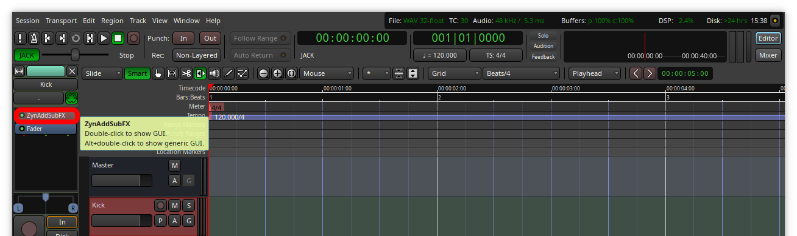
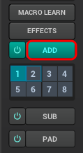
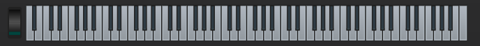
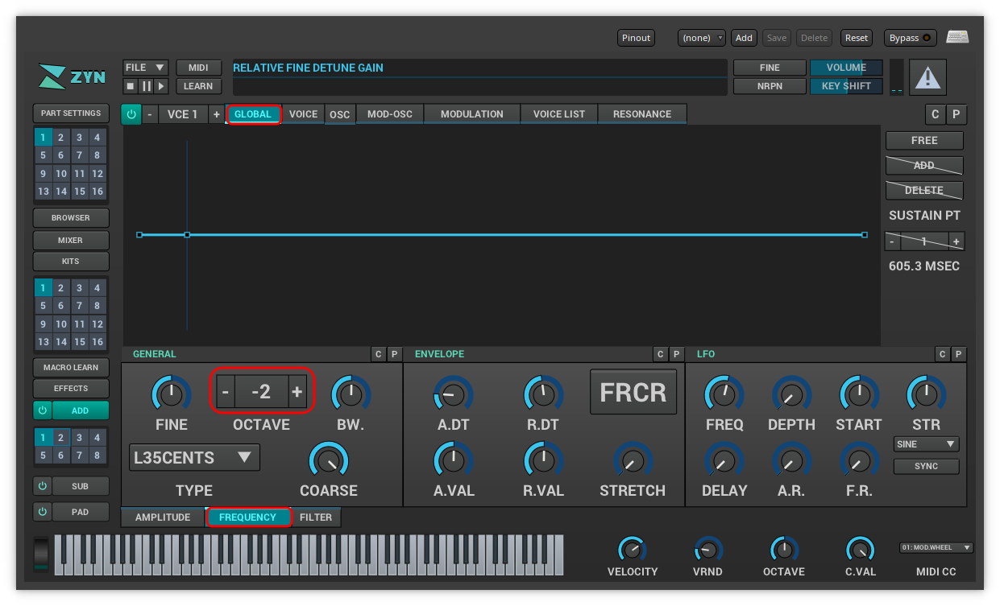
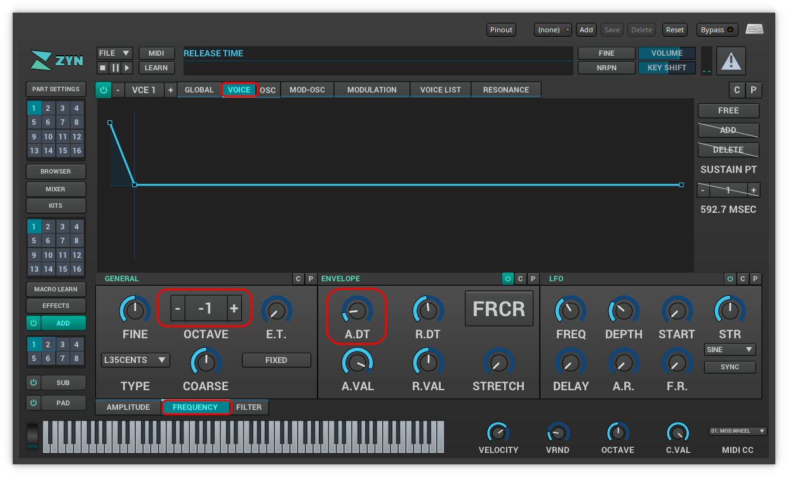
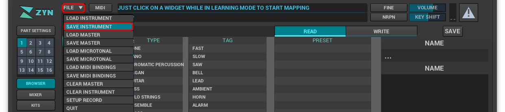
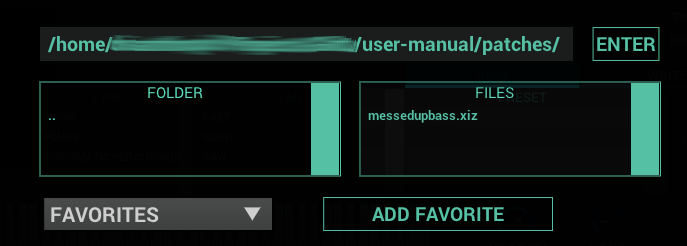
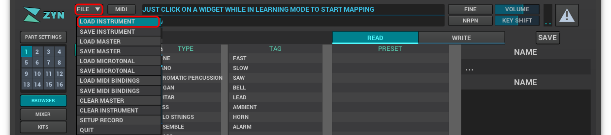

*This quick-start will guide you through the process of using Ardour to launch Zyn-Fusion and then using Zyn-Fusion to open an existing patch and modify it.*

// TODO: Were the unfamiliar terms covered? Maybe just get rid of this sentence and update the glossary.
Don't worry if some or most of these terms are unfamiliar, we'll cover them soon but for now we want to get you having fun making sounds!

When you're finished with this project you'll learn some fundamentals such as:

* _How to use Ardour sessions to save/restore work_
* _How to create Ardour tracks_
* _How to use Zyn-Fusion as a plugin from inside Ardour_
* _How to open and save an existing patch_
* _How to perform basic sound manipulation on an existing patch_

.Prerequisites
WARNING: This guide expects that you are starting with a working installation of Ardour and Zyn-Fusion; at a minimum you should be able to play and hear the Ardour metronome to confirm that your audio is routed properly.

// TODO: Put this on a higher level than the headers below it
==== Create your Ardour session

==== Start a new session
* Launch Ardour and create a new session using the _Empty Template_
** I named mine *QuickStart* but you can choose any name you'd like

==== Add your first track
* Create a new Zyn-Fusion MIDI track for our synthesizer, using `Shift + Ctrl + N`
** *Name:* Synth
** *Instrument:* ZynAddSubFX
** Click `Add and Close`

image::screenshots/ardour-new-track.png[]

==== Save your Ardour session
* Save your Ardour session so the work you just did is saved.
** `Ctrl + S`

==== Launch Zyn-Fusion
* Select your `Synth` track and then *double-click* on the ZynAddSubFX button (circled in red below)

==== Play the default ADDsynth

The ADDsynth is an additive synthesizer. It's totally fine if you don't know what that means yet.

You can launch it by selecting the `ADD` button. Try launching it and then playing a few notes by pressing some keys on your keyboard. You should see the corresponding key light up on the virtual keyboard. Listen to the default sound or "voice" of the ADDsynth.

// TODO: There might be a need to specify the little keyboard icon on the plugin

Next try playing around with the virtual keyboard at the bottom of the window.

==== Open an existing patch

.What is a patch?
NOTE: For now think of a patch as a saved Zyn-Fusion configuration. Once you create a sound you like, you can save the configuration as a _patch_ which can be shared or reloaded to recreate this sound in the future.

Now that you've heard what the default ADDsynth sounds like, let's load up one of the built-in patches.

Click on the "Browser" button to browse the default patches; I'm going to select the `FM Bass 2` preset but you're welcome to pick any preset you like the sound of.

image::screenshots/browser.png[]

Play the synth using your keyboard or the virtual keyboard.

==== Modify an existing patch

Now let's try experimenting with some knobs and dials to see how you can modify the sound.

Try modifying the:

- Global Amplitude Envelope: A.DT

image::screenshots/global-amp.png[]

- Global Frequency Octave

- Voice Frequency Envelope: A.DT & Voice Frequency Octave

==== Save a patch

Let's save your modifications as a custom instrument so you can reload it at any time.

Click on the `File` drop down that is to the right of the Zyn logo and select `Save Instrument`.

Navigate to a directory you want to save the patch in and type a file name before selecting "Enter".

==== Close and relaunch Ardour

Now that you've saved your patch, let's imagine you just closed everything and forgot to save, in fact, go ahead and close Ardour without saving.

Now reopen Ardour and select your session. If you've followed this guide closely then your session should resume right _after_ you added your Zyn-Fusion track, but _before_ you modified any patches. Luckily, you saved your patch before you closed your last session.

==== Load your saved instrument

Relaunch Zyn-Fusion from your Ardour session and load your saved instrument.

Click on the `File` drop down that is to the right of the Zyn logo and select `Load Instrument`.

Navigate to a directory you saved the patch in the previous steps before selecting "Enter".

Once you've loaded your instrument the synthesizer should play the sounds you saved.

Congratulations, you've synthesized your first custom sound!
