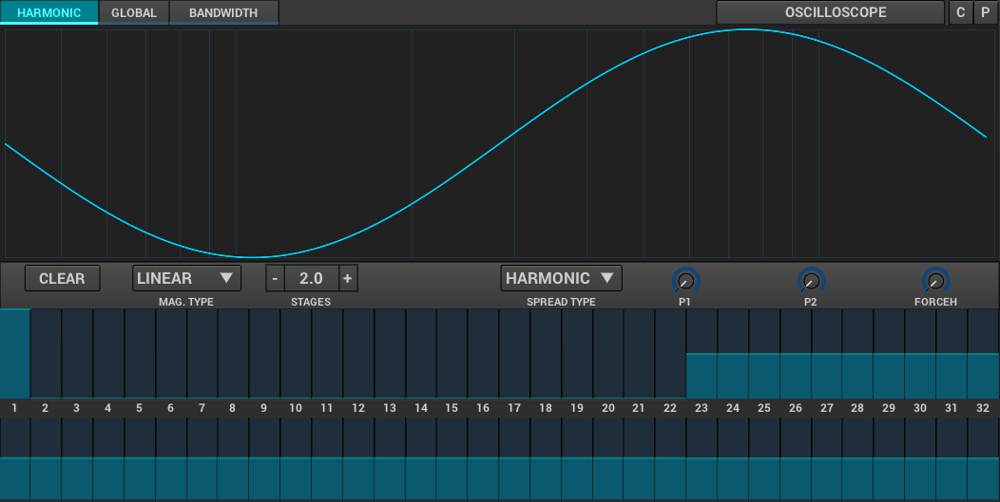

=== SUBSynth

SUBSynth is ZynAddSubFX's subtractive synthesizer!

A subtractive synth works by taking noise and filtering out tiny bands of frequencies.
By filtering out bands, we start generating pleasant noises that sound like very stereo-rich sine waves.

We're first introduced to SUBSynth via the two strips of faders at the bottom of the panel,
similar to the <<synth-osc, oscillator editor>>, inside the "Harmonic" tab.
The top ones set the amplitude of the bands. The bottom ones set the resonance of the bands.
The bands are placed on harmonic distances.
Use this tab to sculp your sound band by band!

After doing that, we move onto the "Bandwidth" tab.
Consider this tab a place where you can make finishing touches to the resonances of the bands,
by affecting all of them with the same number of stages, bandwidth width, etc.
Additionally, the bandwidth can be changed over time using <<synth-env, the evnelope>>!

And finally, in "Global", we make the standard changes to
the <<synth-ampset, amplitude>> and <<synth-freqset, frequency>>,
as well as the optional <<synth-res, resonance>> and <<synth-filset, filter>>.

// TODO: Signal routing diagram
// TODO: Tutorials
