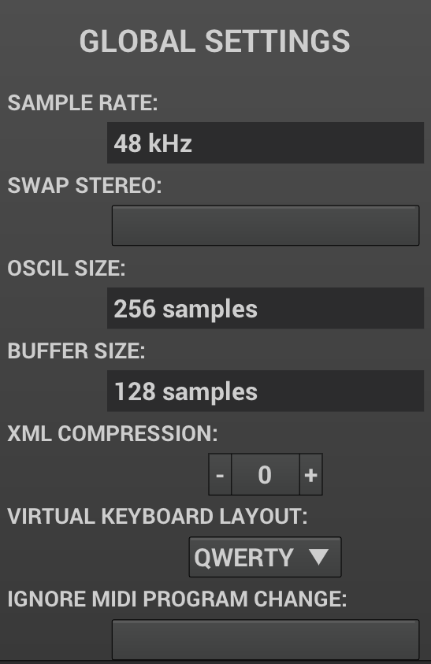
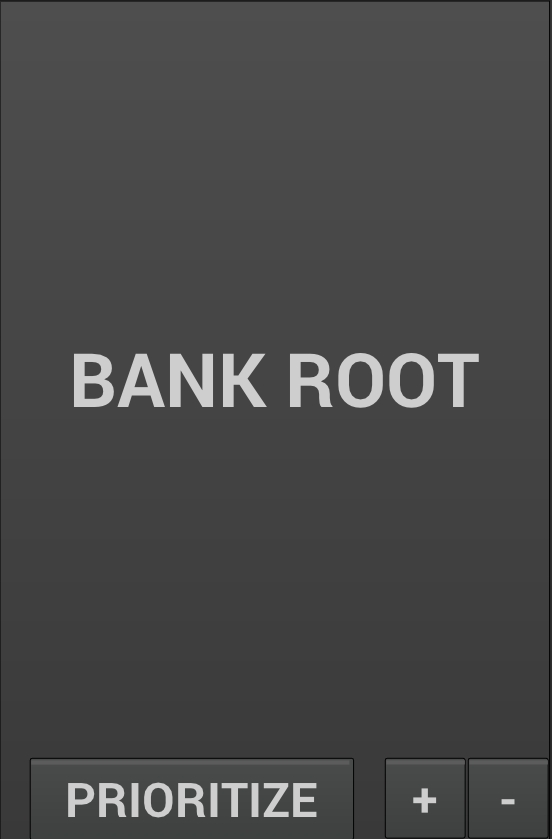

=== Accessing Settings

To access the settings view, click twice on the Zyn logo in the top left corner.

=== Global Settings
[[global-settings]]

These settings affect the whole ZynAddSubFX instance.

WARNING: Currently some of these parameters are read-only

// issue: https://github.com/zynaddsubfx/zyn-fusion-issues/issues/161

.Sample Rate
The sample rate used by ZynAddSubFX engine. +
The begger - the higher frequencies will be processed, introducing more DSP load in the system
It's best to keep this the same as your soundcard is currently using to avoid needless resampling.

.Swap stereo
If you find your L and R channels to be the wrong way around, this option will fix it.

.Oscil Size
The size of the SUBsynth oscillator wavetable in samples. The bigger this is, the more high frequencies will be included in the SUBsynth osciallators. The bigger the wavetable, the more CPU-intensive SUBsynth becomes, but also playing very low notes will remain more high harmonics.

.Buffer Size
Size of the internal DSP buffer of ZynAddSubFX in samples. Since the LFOs and Envelopes are updated only once every bufer this has impact on the sound. The smaller the buffer is, the better the time resolution of LFOs and ENVs. It also makes the latency lower. Making the buffer size bigger lowers the CPU usage in exchange for increating latency and making the LFOs and ENVs update less frequently.

.XML compression
ZynAddSubFX uses XML format to store the presets. This determines the level of Gzip (?) compression applied to it before saving to disk, to save storage space. Higher values create smaller files in exchange for more CPU time needed to save and open them. Lower values speed up save/load times but create bigger files.

.Virtual Keyboard Layout
This setting afects how Zyn-Fusion interprets input from your computer keyboard to emulate a musical keyboard.

.Ignore MIDI Program Change
ZynAddSubFX would noramlly respond to MIDI Program Change messages and load a patch from a bank. This feature will enable you to prevent that.

=== Bank Settings

=== Preset Settings
image::imgs/Selection_424.png[]
