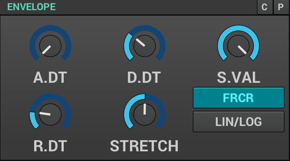
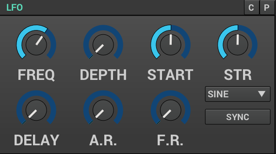
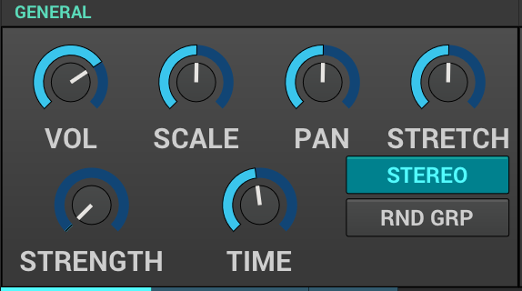

Synthesizers are built out of a collection of modules ranging from oscillators,
to filters, envelope generators, amplifiers, and more.
These are all building blocks that put together in a certai way make a (hopefully) musical instrument.

Zyn-Fusion is no different.
Let's talk about various types of modules that you'll encounter exploring Zyn-Fusion.
If you take some time to familiarize yourself with these - you'll have a much easier
time finding your way through the interface for each of the synthesizing engines found
in Zyn-Fusion, as you'll recognize different modules and their functions.

=== Oscillator Module
include::OscillatorModule.adoc[]

=== Filter Module
include::FilterModule.adoc[]

=== Envelope Module

* ADSR
* Free mode

=== LFO Module

=== amplifier (?)

* vol
* scale
* pan
* stretch
* punch strength and time

=== Pitch control (?)
