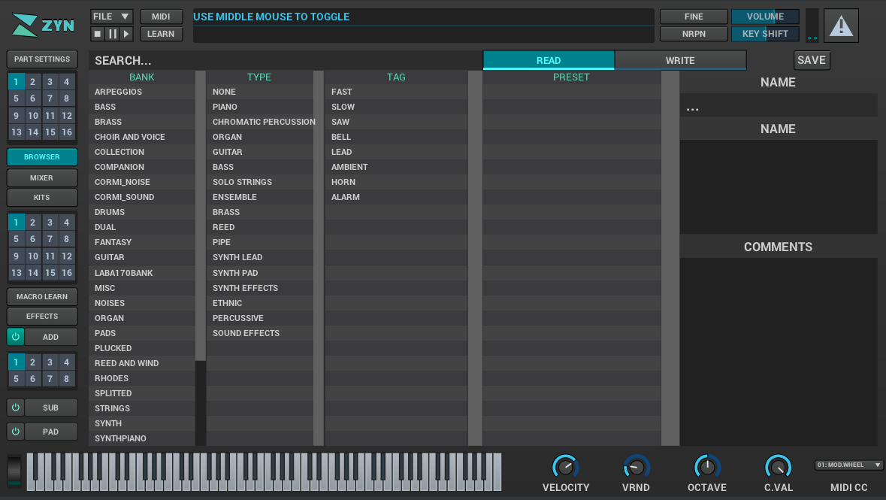

= Zyn-Fusion UI overview

This section contains an overview of Zyn-Fusion's UI and how to interact with it.

== Zyn-Fusion panels

Zyn-Fusion's UI is divided into panels:

* Status Panel
* Navigation Panel
* Main Panel
// * Virtual Keyboard

The status panel contains application-relevant information, like the file menu. The navigation panel displays different views in the main panel, which is where most of the editing happens in Zyn-Fusion.

=== Status panel
The status panel is where shows global parameters, the file menu,
automation-learn/fine-tuning mode selectors, the panic button, master VU meter,and the information tray.

Panic button::
    Silences all audio produced by Zyn-Fusion, regardless of what state the synthesizer is in.
Master VU meter::
    Displays the current audio output levels. Can be used for the folowing tasks:
    * Deciding on an optimal sound level for a patch.
    * Showing whether or not an instance of Zyn-Fusion is currently producing sound. This is useful if you are using more than one instance of Zyn-Fusion simultaneously.
    * Ensuring your MIDI keyboard is connected.
Fine indicator::
    Shows when parameters are being finely adjusted. Fine adjust
    is trigged by holding the *Shift* key on a keyboard or by using the indicator.
Learn indicator::
    Shows when automation learning is in progress.
Information Tray::
    Shows tooltips about Zyn's parameters, current
    parameter values, as well as other status information. image:imgs/Selection_437.png[]

////
.Under Construction
NOTE: At a later point is may be worth describing: NRPN - currently
      non-functional, audio capture (may be worth removing at some point), etc,
      but there are higher priority things to document at the moment
////

////
unfa:
NOTE: Then we'll split up each into parts and describe what each part does in detail, covering every button and field.
      When a button opens a dialog of another window.
      For example clicking on the logo opens up settings - we can branch out and cover that in a different section
      if it's appropriate.
      For example a chapter about Zyn preferences and simply say "here are user preferences - more on that in chapter X"

fundamental:
Contrary to this I'd say do *not* detail everything. Detail what's important and
what can be integrated with the section's flow easily.
The overall guide should help users and not serve as a full specification

unfa: ok, but then -  is there a place for the full specification? I think it's also needed. Do you mean a destinction between a User Manual and a Reference Manual?
////

////
Commented out since this appears to be discussed later
=== Virtual Keyboard

* Virtual keyboard (also usable with QWERTY keyboard - that's important!)
* Virtual keyboard knobs
* MIDI CC selector

unfa Q: can we use this to with that pitch bend?
fundamental A: I don't think it's wired up that way at the moment as pitch bend
has a different parameter resolution comared to others. This can change in a
future version however

unfa Q: can we fake MIDI CC input for Macro learn?
fundamental A: If it does behave that way now, I'd think it would be wise to
make it not behave that way in the future.
////

=== Navigation panel

The left panel, or navigation panel, changes what view the content panel is
actively presenting.

The following views are available:

// Note (celestehorgan): it might be a good idea to include a small description of each view :)

* Part settings
* Part Grid - the active part ID
* Browser
* Mixer
* Kits
* Kit Grid - the active kit ID
* Macro Learn
* Effects
* Add synth
* Add synth Voice Grid - the active voice ID
* Sub synth
* Pad synth

For all of the grid selectors you can change the active IDs with the left mouse button or enable/disable the selected ID via the middle mouse button.

=== Main panel

Here's where the most of the action happens.
When you start Zyn-Fusion it'll begin by showing you the Browser.
Use the Side Bar to select what should be displayed here.

There's not much to say about this region of the interface, because its
looks and functions will vary wildly based on the context selected by the
navigation panel.

== Interacting with Zyn-Fusion

=== Using the UI controls
Zyn-Fusion uses a number of UI controls, including:

* Buttons
* Sliders
* Knobs
* Number fields
// * Anything else?

==== Resetting a knob or slider

To reset a knob or slider to its default position, either double-click the left mouse button or click the middle mouse button.

=== Using the keyboard

Zyn-Fusion lets you use the keyboard in two ways:

* Playing musical notes with the alpha-numeric keyboard
* Keyboard shortcuts

==== Playing musical notes with the alphanumeric keyboard

Zyn-Fusion allows you to use the alphanumeric keyboard to play nots on the virtual keyboard. For example, pressing the **Q** key plays a C-4 note, and pressing the **Z** key plays a C-3 note.

TIP: For more information, see <<Settings.adoc#global-settings>>.

// above is a non-working reference to another chapter. How do we make this work? Related issue: https://github.com/zynaddsubfx/user-manual/issues/3

==== Keyboard shortcuts

Zyn-Fusion supports the following keyboard shortcuts to access global controls:

* **Ctrl**: Hold down to activate **Learn** mode. Any control selected is assigned to a macro.
// Here should be a reference to chapter about Macro Learn.

* **Shift**: Hold down to activate **Fine** mode. Increases input resolution for more precise manipulation.

////
.Documentation Idea
NOTE: It would be great to have an automated method for generating a cheat-sheet
like view for the keybindings like discussed in
https://tex.stackexchange.com/questions/44581/creating-keyboard-layout-diagrams

ISSUE:: https://github.com/zynaddsubfx/user-manual/issues/7
////
