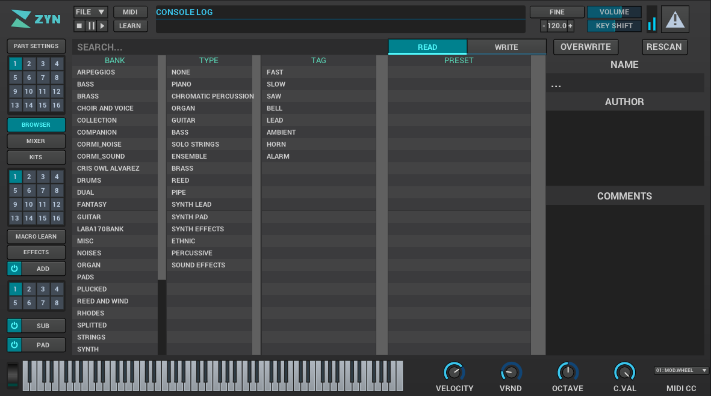

This section aims to introduce the user to Zyn's UI elements and explain their behaviour in detail.

==== Panels

When you run Zyn-Fusion you'll be presented with this window:

// TODO: Color the elements here and use the colors as help.

// TODO: Each panel a color
As you can see it is divided into multiple panels, each with their own use.
When navigating between different _views_, you'll consistently see the status
panel on top of the window, the navigation panel on the left, and the bottom the
virtual keyboard.
In the middle of all of those is the content view which you can expect to change
when navigating around Zyn-Fusion

.Status Panel
The status panel is where you'll find a few global parameters, the file menu,
automation-learn/fine-tuning mode selectors, the panic button, master VU meter,
and the information tray. It is always situated at the top of Zyn's UI.
We will be reading the status panel right-to-left, since you'll most often be using
the righthand side.

Panic button::
    When getting started you'll want to be familiar with the panic button as
    it will instantly silence the audio produced by Zyn, no matter what state
    the synth is in. It's a safety device in case the sounds go out of control.

Master VU meter::
    This meter will display the current audio output levels. It can be useful for a few things:
    * It'll let you decide on choosing an optimal sound level for your patch.
    * It might be helpful to find out which instance of Zyn-Fusion is currently making sounds, if you're working with a few of them at once.
    * It'll help you make sure your MIDI keyboard is connected properly.

Volume slider::
	This slider is used to change the global volume of ZynAddSubFX.

Key shift slider::
	TODO

Fine indicator::
    This indicator shows when parameters are being finely adjusted. Fine adjust
    is trigged by holding *SHIFT* and it can be toggled by clicking on the
    indicator.

Learn indicator::
    This indicator shows when automation learning is in progress.

Information Tray::
    The information tray will show tooltips about Zyn's parameters, current
    parameter values, as well as other status information. Image below.

// TODO: NRPN is not a thing anymore, we now what the BPM textbox

// TODO: Mixed indentation, link to the config window UI
Zyn-Fusion logo box::
	Clicking on the Zyn-Fusion logo toggles two different windows,
	one of them is a wall of text dedicated to all the maintainer of Zyn-Fusion and modern ZynAddSubFX,
	while the other one, more important to you as the user, is the configuration window.

"FILE" button::
	This button is used to handle all file operations, such as saving, loading and clearing instruments,
	MIDI bindings, microtonal settings, etc.

// TODO: The play/pause/stop buttons

////
.Under Construction
NOTE: At a later point is may be worth describing: NRPN - currently
      non-functional, audio capture (may be worth removing at some point), etc,
      but there are higher priority things to document at the moment
////

////
unfa:
NOTE: Then we'll split up each into parts and describe what each part does in detail, covering every button and field.
      When a button opens a dialog of another window.
      For example clicking on the logo opens up settings - we can branch out and cover that in a different section
      if it's appropriate.
      For example a chapter about Zyn preferences and simply say "here are user preferences - more on that in chapter X"

fundamental:
Contrary to this I'd say do *not* detail everything. Detail what's important and
what can be integrated with the section's flow easily.
The overall guide should help users and not serve as a full specification

unfa: ok, but then -  is there a place for the full specification? I think it's also needed. Do you mean a destinction between a User Manual and a Reference Manual?
////

////
Commented out since this appears to be discussed later
==== Virtual Keyboard

* Virtual keyboard (also usable with QWERTY keyboard - that's important!)
* Virtual keyboard knobs
* MIDI CC selector

unfa Q: can we use this to with that pitch bend?
fundamental A: I don't think it's wired up that way at the moment as pitch bend
has a different parameter resolution comared to others. This can change in a
future version however

unfa Q: can we fake MIDI CC input for Macro learn?
fundamental A: If it does behave that way now, I'd think it would be wise to
make it not behave that way in the future.
////

==== Navigation Panel

The left side of the screen can be used to change what view the content panel is actively presenting.
The side panel is used to navigate between different parts of the user interface.
From here you can change the view in the main panel to:

* Part settings
* Part Grid - the active part ID
* Browser
* Mixer
* Kits
* Kit Grid - the active kit ID
* Macro Learn
* Effects
* Add synth
* Add synth Voice Grid - the active voice ID
* Sub synth
* Pad synth

For all of the grid selectors you can change the active ID with the left mouse
button or you can enable/disable the selected ID via the middle mouse button.

==== Main Panel

Here's where the most of the action happens.
When you start Zyn-Fusion it'll begin by showing you the Browser.
Use the Side Bar to select what should be displayed here.

There's not much to say about this region of the interface, because its
looks and functions will vary wildly based on the context selected by the
navigation panel.

==== General conventions
The Zyn-Fusion GUI tries to maintain a consistent language through it's
controls.
The ones you'll see most commonly are:

* Buttons
* Sliders
* Knobs
* Number fields
* Input boxes

The knobs and sliders can be reset to their default position with a double-click or a middle-mouse-click.

==== Using the Keyboard

Zyn-Fusion lets you use the keyboard in two ways:

* playing notes with the alpha-numeric keyboard
* accessing special functions with modifier keys

For example you can play a C-4 note by pressing the Q key, or play the C-3 note with the Z key. You can also change the keyboard layout between QWERTY and AZERTY in the Global Settings.

// Here should be a reference to an appropriate Global Settings subchapter

TIP: you can learn more about this in the <<Global Settings>> chapter.

// above is a non-working reference to another chapter. How do we make this work? Related issue: https://github.com/zynaddsubfx/user-manual/issues/3

Holding down Ctrl will temporarily activate Learn mode - any control touched will be assigned to a macro.

// Here should be a reference to chapter about Macro Learn

Holding down Shift will temporarily activate Fine mode - this will greatly increase the input resolution allowing for more precise manipulation.

////
.Documentation Idea
NOTE: It would be great to have an automated method for generating a cheat-sheet
like view for the keybindings like discussed in
https://tex.stackexchange.com/questions/44581/creating-keyboard-layout-diagrams

ISSUE:: https://github.com/zynaddsubfx/user-manual/issues/7
////

// TODO: ==== Configuration window
// Where does it save configs?
