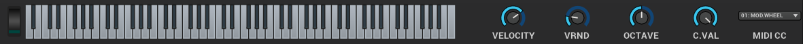
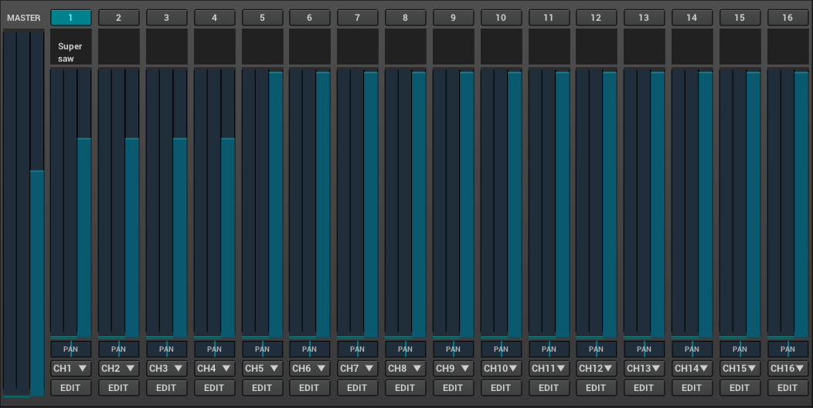
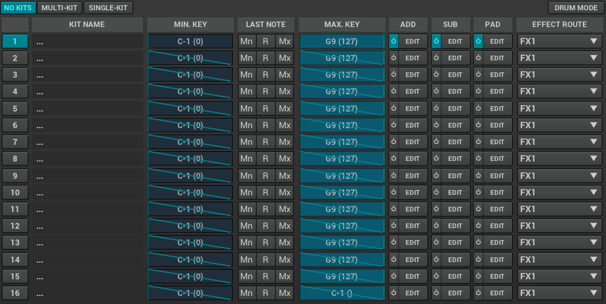

// TODO: Resonance tab

This section aims to introduce the user to Zyn's UI elements and explain their behaviour in detail.

=== Panels

When you run Zyn-Fusion you'll be presented with this window:

// TODO: Color the elements here and use the colors as help, if possible.
// https://github.com/zynaddsubfx/user-manual/pull/22#discussion_r1717684016

// TODO: Each panel a color
As you can see it is divided into multiple panels, each with their own use.
When navigating between different _views_, you'll consistently see the status
panel on top of the window, the navigation panel on the left, and the bottom the
virtual keyboard.
In the middle of all of those is the content view which you can expect to change
when navigating around Zyn-Fusion

==== Status Panel

The status panel is where you'll find a few global parameters, the file menu,
automation-learn/fine-tuning mode selectors, the panic button, master VU meter,
and the information tray. It is always situated at the top of Zyn's UI.
We will be reading the status panel right-to-left, since you'll most often be using
the righthand side.

Panic button::
    When getting started you'll want to be familiar with the panic button as
    it will instantly silence the audio produced by Zyn, no matter what state
    the synth is in. It's a safety device in case the sounds go out of control.

Master VU meter::
    This meter will display the current audio output levels. It can be useful for a few things:
    * It'll let you decide on choosing an optimal sound level for your patch.
    * It might be helpful to find out which instance of Zyn-Fusion is currently making sounds, if you're working with a few of them at once.
    * It'll help you make sure your MIDI keyboard is connected properly.

VOLUME slider::
    This slider is used to change the global volume of ZynAddSubFX.

// TODO: When this changes, use: Allows shifting the input note up/down by a specified amount.
KEY SHIFT slider::
    Allows shifting the relation between which note would be played originally and which is played now.
    64 means no keyshifting.
    Setting the key shift below 64 shifts the keys down by the absolute difference between 64 and the key shift value.
    Setting it above 64 does the same, except that it shifts the keys up.
    For example, 63 shift all the keys down by 1, and 65 shifts them up by 1.

Fine indicator::
    This indicator shows when parameters are being finely adjusted. Fine adjust
    is trigged by holding *SHIFT* and it can be toggled by clicking on the
    indicator.

// TODO: More info about this in the manual? Do tutorials instead.
BPM panel::
    This panel allows setting the BPM used by the project. This BPM is used
    by LFOs whose frequency is defined with a numerator and denominator.

Information Tray::
    The information tray will show tooltips about Zyn's parameters, current
    parameter values, as well as other status information. Image below.

// TODO: NRPN is not a thing anymore, we now what the BPM textbox
image:imgs/info-tray.png[]

// TODO: More info here
MIDI Learn indicator::
    This indicator shows when MIDI contoller learning is in progress.

// TODO: More info here
Learn indicator::
    This indicator shows when automation learning is in progress.

"FILE" button::
    This button is used to handle all file operations, such as saving, loading and clearing instruments,
    MIDI bindings, microtonal settings, etc.

// TODO: More info here
Stop/Pause/Play buttons::
    Used for the WAV recording feature.

// TODO: Mixed indentation, link to the config window UI
Zyn-Fusion logo box::
    Clicking on the Zyn-Fusion logo toggles two different windows,
    one of them is a wall of text dedicated to all the maintainer of Zyn-Fusion and modern ZynAddSubFX,
    while the other one, more important to you as the user, is the configuration window.

////
.Under Construction
NOTE: At a later point is may be worth describing: NRPN - currently
      non-functional, audio capture (may be worth removing at some point), etc,
      but there are higher priority things to document at the moment
////

////
unfa:
NOTE: Then we'll split up each into parts and describe what each part does in detail, covering every button and field.
      When a button opens a dialog of another window.
      For example clicking on the logo opens up settings - we can branch out and cover that in a different section
      if it's appropriate.
      For example a chapter about Zyn preferences and simply say "here are user preferences - more on that in chapter X"

fundamental:
Contrary to this I'd say do *not* detail everything. Detail what's important and
what can be integrated with the section's flow easily.
The overall guide should help users and not serve as a full specification

unfa: ok, but then -  is there a place for the full specification? I think it's also needed. Do you mean a destinction between a User Manual and a Reference Manual?
////

////
Commented out since this appears to be discussed later
==== Virtual Keyboard

* Virtual keyboard (also usable with QWERTY keyboard - that's important!)
* Virtual keyboard knobs
* MIDI CC selector

unfa Q: can we use this to with that pitch bend?
fundamental A: I don't think it's wired up that way at the moment as pitch bend
has a different parameter resolution comared to others. This can change in a
future version however

unfa Q: can we fake MIDI CC input for Macro learn?
fundamental A: If it does behave that way now, I'd think it would be wise to
make it not behave that way in the future.
////

==== Navigation Panel

The navigation panel is situated on the left side of the Zyn-Fusion UI and, much like the
status panel, is always present there.

It is used to change what the main panel is actively presenting.
The options, from top to bottom, include:

* <<_part_settings, Part settings>>
* The part selection grid
* <<_browser, The browser>>
* <<_mixer, The mixer>>
* <<_kit_settings_panel, Kit settings>>
* The kit selection grid
* <<_macro_learn_panel, The macro learn panel>>
* <<_effects_panel, The effects panel>>
* <<_addsynth, The ADDSynth panel>>
* The ADDSynth voice grid
* <<_subsynth, The SUBSynth panel>>
* <<_padsynth, The PADSynth panel>>

Each grid houses multiple elements with the same functionality,
and has one lit-up square, which is the currently displayed element.
Each active element has a border around it.
*To view an element in the grid, left-mouse click it.*
*To enable an element in the grid, middle-mouse click it.*

==== Main panel (Introduction)

The main panel is where most of the action happens.

The scope of that is, understandably, very large, so it warrants
<<_main_panel, its own section in this part of the manual, visible below>>.

==== Virtual keyboard panel

While it is true that you will most often pass notes to ZynAddSubFX using MIDI, the virutal
keyboard panel exists as a way to pass notes directly from the Zyn-Fusion UI!

.How does playing notes from Zyn-Fusion work?
NOTE: You can play notes from Zyn-Fusion either by clicking on the notes in the vritual keyboard in the UI,
or pressing on your computer keyboard, which will trigger the notes the same way as mouse-clicking them!

From-left-to-right, the panel features a modulation wheel, the keyboard, a set of parameters, those being
the note velocity, velocity randomness, the octave shift, the MIDI CC value and selection.

=== Main panel

The main panel covers all the core functionality in Zyn-Fusion,
in regard to sound design, effects, mixing, and so on.

We'll go over each subpanel from top to bottom as seen in the <<_navigation_panel, navigation panel>>.

==== Part settings

// TODO: Image with colors, or multiple images, if possible

This subpanel is dedicated to setting up each the properties of each part.

.What is a part?
NOTE: A part is a single element in ZynAddSubFX capable of generating sound.
In one part, any of ZynAddSubFX's three synths can be active.
So, think of parts like mini synths inside ZynAddSubFX
which you can use to have multiple layers to sounds,
or have multiple sounds, maybe with different timbres, on one keyboard,
and so on.

===== Part enabling and naming

This subpanel consists of pairs of a button and a text input box.
The button enables the appropriate part, and the input box allows naming the part.

===== Instrument settings

Here, we set up basic MIDI-related properties of the part.
This includes properties such as the volume, panning, in what range it accepts MIDI notes,
velocity sensing and randomness, key shifting, etc.

The minimum and maximum key knobs are used to set the minimum and maximum key that the part will play.
Additionally, you can use the `Mn` and `Mx` buttons to store the last key ZynAddSubFX accepted as the
minimum and maximum keys. `R` resets the range to cover the full keyboard!

The "CH-" dropdown box is used to select which MIDI channel the part will accept notes from.
Since there are 16 parts and 16 MIDI channels, by default each part is assigned to each channel.
If you layer multiple parts together, you should set them all to the same MIDI channel, so they
play the same notes!

.Layering sounds
NOTE: If you want to layer multiple parts, set them all to accept notes from the same MIDI channel (usually CH1).
This way, they'll all play the same notes!

.Live play
NOTE: If you play Zyn-Fusion live using a MIDI keyboard, you can have one instrument on one part of the keyboard, another one on another one, etc.
For example, you can have a bass in range A1-A3, a piano in range A3-A6, and strings in range A6-C7.
This means you can play three instruments not only using one keyboard, but on Zyn-Fusion instance!

You can also set the polyphony type using the "Poly/Mono/Legato/Latch" dropdown.

- "Poly" means you can play as many notes as the voice limit allows you to play! Use this mode for any case of stacked notes (e.g. chords).
- "Mono" means you can only play one key. If you play two notes at the same time, only one will actually make a sound (e.g. arppegio).
- "Legato" is similar to "Mono", except that it will shift the frequency from the perviously played note to the current one (e.g. lead instrument).
- "Latch" means that any keys currently playing will keep playing, even when not held down, until a new key, or new keys, are played (e.g. live play).

You may have noticed that "Poly" can only play as many notes as the voice limit allows.
Keep in mind that, if the voice limit is set to 0, it can a practically infinite number of voices.

===== Controllers

// TODO: What are these? What is MIDI CC? How does it work? Append appropriate info to glossary.

////
TODO

Most of these are not covered in detail.
- What happens when they're set to 0 and 127?
- What is the modwheel exponential mode?
- What happens for values of 0 and 127 for these?
  For example, how much does the modwheel bend when it's set to 127?
  Does it bend by the value dictated by PCH.D?
- As for the sustain CC, how long is the sustain, where is that set?
////

This section is dedicated to MIDI CC and is useful for automation or live play!

MIDI CC (Continous Controllers) is, essentially, used to automate certain properties of your MIDI playback.
The ones you should be met with are the MIDI modwheel, filter cutoff, filter resonance and pitch-bending.

Use the tooltips visible in the information tray to get information about each knob and button.

.I produce on a DAW. Should I care about these settings?
NOTE: _YES!_ Specifically, you should care about "PCH.D", the pitchbend depth.
In DAWs with MIDI CC automation support (such as Ardour), you can automate pitch-bending, which is very useful.

===== Portamento

// TODO: Proportional and auto

Portamento is a term that describes a pitch-slide from one note to another.

.When to use it
NOTE: Use portamento whenever you want to play only one note at a time and have a smooth transition between your notes.

Once enabled, you can change a couple properties of your portamento.

You can change how long it takes it to slide using the "Time" knob.

The "THRESH" number field allows you to set a semitone distance at which the portamento takes place.
The `>` / `<` buttons set how the limit behaves.
`>` sets the portamento to be active when the distance between the notes is more than the limit, and vice versa.

You can change if the portamento slides up or down faster using the "UP/DWN" knob.
If less than the middle value, it will slide down faster than up, and vice versa.

// TODO: This section, as a whole
===== Scale settings

This section of the part settings panel is used for making microtonal mappings, so you most likely won't be using it often.

These are the only settings that is shared by each part.

==== Browser

Allows browsing the ZynAddSubFX collection of ready-made sounds.
It features a search bar and 4 columns, which can all be clicked to be toggled:

1. *BANK*: The actual preset collection. Hovering over each one shows you where it is in the filesystem.
2. *TYPE*: Allows selecting a specific type of preset. Useful for filtering.
3. *TAG*: Further filtering using tags.
4. *PRESET*: The actual list of presets.

==== Mixer

The mixer allows mixing of each part (the part mixer strip) as well as the output signal (labeled as "MASTER", the master mixer strip).

.The master strip

The master mixer strip features two vertical segments,
one being the VU meter,
and the other being the vertical global volume fader.
This fader is actually the same one seen in the status panel!

.The part strip

From top to bottom, the part strip contains:

1. A PART ENABLE button, which toggles the part on and off.
2. The same VU meter and volume fader as in the master strip, only applied to the part.
3. Part panning. 64 is the default and is also the middle-point.
4. Active MIDI channel dropdown, identical to the one in the <<_instrument_settings, instrument settings>>.
5. The EDIT button, which sets the current part as the one you can edit in <<_part_settings, part settings>>.

Even though the part settings offer a volume knob, you can always use the mixer
to have visual feedback on how loud your parts are relative to each other!

==== Kit settings panel

This panel allows you to effictively configure ZynAddSubFX into a kit.

// TODO: A part with one ADD/SUB/PAD is actually a part with one kit with one ADD/SUB/PAD

.What is a kit?
NOTE: Think of a kit as a subsection of a part. Each part has 16 kits, each of which can be assigned an instance of
ADDSynth, SUBSynth and PADSynth, as well as any combation of them. A kit gets its name from the fact that it allows
you to turn any part into a sound kit, with 16 sounds at most. A good example of a kit is a drum kit, where you
set up each drum to be on a different note (e.g. kick drum is on part 1 and plays on C4, snare is on part 2 and plays on C#4, etc).
Another example might be a collection of sound effects.

The first settings you'll run into, just above the big wall of repeating settings, is three buttons that determine how the part's kits will act.

- For "NO KITS", only the first kit can be active, while the rest are off
- For "MULTI-KIT", for any played note, every kit that has that note in its key range will play
- For "SINGLE-KIT", for any played note, only the first kit that has that note in its key range will play

As for the big wall of settings, we've already ran into these settings perviously, in part settings.
They function identically as in the part settings, except that they apply to the kit.
The only new addition is the effect route.

.The effect route
NOTE: A part has an effect chain consisting of three effects. The order they are processed in is FX1 to FX3.
The effect route dropdown allows setting the starting point of the effect processing for that kit.
By default, a kit starts at FX1, meaning that it goes through all three effects.
There is, of course, an option to not route the kit through the effect chain, in the dropdown.

==== Macro learn panel

This panel is where all non-MIDI related automation happens!

Zyn-Fusion gives you the ability to assign almost every knob and fader in the synth to any of the 16 automation slots.
_"ALMOST every?"_ Yes, the only thing you can't automate with the automation slots are the automation slots!
Each slot can house 4 different parameters, each of which can be automated with different slopes, meaning that some paramteres can move up,
while others move down, all using the same automation slot!

*_"So how do I actually automate a parameter?"_* I hear you ask!
Select the "Learn" button, which is right next to the information tray, at the top of the UI,
and change the value of the parameter you wanna automate.
This will bind it to the active automation slot. You may have noticed there are two types of learning,
which you can see above the parameter automation slopes, those being
"Normal learn" (One slope per parameter), or "Macro learn" (One slope for all move parameters).

The panel is split in two halves.

The left half is dedicated to clearing, naming and focusing the automation slot.

Once you focus an automation slot of your choice, using the triangle button, the right half will display the four automation parameter slopes.

==== Effects panel

This panel allows adding effects to your sound.

There are three types of effects you can add.
We'll list them from right to left, since you'll most commonly be using them in that order:

.Part insertion effects

Part insertion effects are added to the part output.
Each part has its own part insertion effects.
The effects are processed in-order (1 through 3).
You can bypass any effect, allowing you to test how the part sounds with and without it.
This is the only type of effect stack that exports with the instrument.

////
TODO: Verify the truthfulness of this

Each effect has three options relating to how the effect process chain happens:

1. "Next effect" simply takes the whole output of the signal and moves it to the next effect,
or the master, if we're at the last effect.

2. "Part out" sends the signal straight to the output after being processed by the signal,
ignoring all effects below it.

3. "Dry out" combines the previous two, sending a copy of the processed signal both to the output
and down to the next element in the effect chain.
////

.Insertion effects

Insertion effects allow you to insert any effect to any part, or directly to the output signal
(labeled as "master" in the dropdown menu). There are 8 available slots, which are also processed in-order.

.System effects

System effects are quite different from the previous two.
You have four effect slots, which are shared by each part.
What each part doesn't share is the amount of the dry signal sent to each of the effects.
After effect 1 is processed, you can send a certain amount of it to effect 2.
You can then send the outputs of effect 1 and 2 to 3. The same logic applies for effect 4.
You choose how much of the part sound is sent to effects using the faders below the effect dropdown,
and how much of each effect is sent to the next effect using the fader matrix at the bottom of the tab.

// TODO: When to use each one?

==== Synthesis engines (Introduction)

As you probably know, ZynAddSubFX features three synthesis engines.
Of course, they all have a lot to talk about, so they're described in detail in their own separate sections.
Feel free to click on any of them to read more about them!

The synthesis engines are:

1. <<_addsynth, ADDSynth, an additive synthesizer.>>
2. <<_subsynth, SUBSynth, a substractive synthesizer.>>
3. <<_padsynth, PADSynth, ZynAddSubFX's quite unique synthesizer, capable of spreading a certain oscillator sound across a wide bandwidth of frequencies.>>
